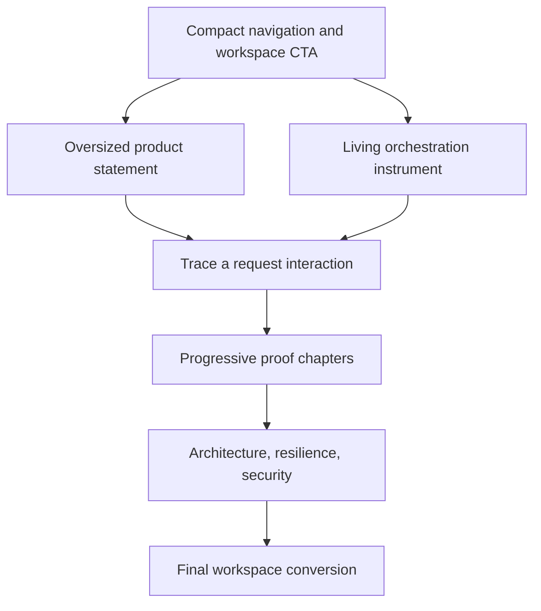
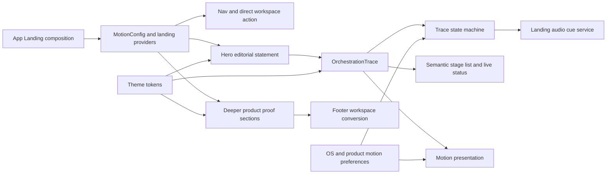
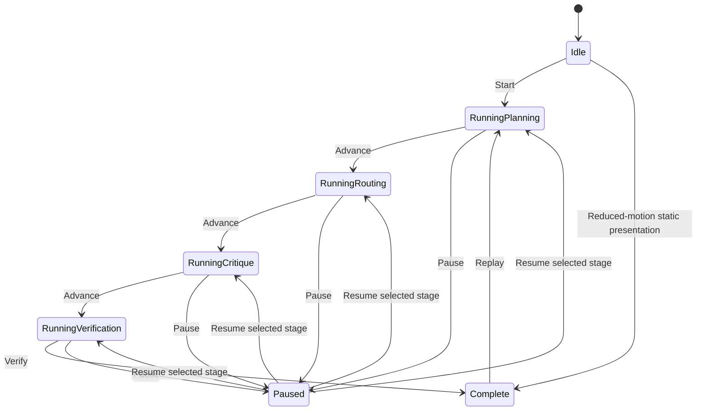

# Cinematic Command Deck Landing - Plan

## Goal Capsule

- **Objective:** Redesign the public VibeAI landing page as a cinematic Command Deck that makes multi-agent orchestration feel premium and understandable.
- **Product authority:** `Neuronova-vibeaiwebsite/PRODUCT.md` owns product truth; this plan owns the public landing experience only.
- **Open blockers:** None. Exact visual implementation, timing, and asset choices belong to planning.

---

## Product Contract

### Summary

The public landing page will pair oversized editorial messaging with a living orchestration instrument in the first screen.
The page will turn the promise into proof by revealing how VibeAI plans, routes, critiques, and verifies complex work.

### Problem Frame

The current landing page explains the system and already contains motion, sound, responsive behavior, and orchestration proof.
Its restrained technical presentation can still resemble a generic AI engineering showcase, which weakens the premium first impression the user wants.
The redesign must create a memorable visual identity without obscuring the fact that VibeAI is a multi-provider, multi-agent system rather than a single model behind a chat box.

### Key Decisions

- **Command Deck is the primary composition** (session-settled: user-directed — chosen over Mission Sequence and Council Arena: it creates the strongest premium first impression while keeping the system understandable). Governs R1, R2, R5, R6.
- **The orchestration mechanism is the spectacle.** Generic AI decoration would weaken product differentiation. Governs R3, R4, R7.
- **Violet and cyan remain brand anchors, not fixed layout constraints.** The redesign may change typography, surfaces, balance, and composition. Governs R8, R9.
- **Sound remains opt-in.** The experience may become richer after consent but must be complete when silent. Governs R10.
- **Responsive and reduced-motion experiences are first-class compositions.** They must preserve meaning rather than imitate desktop motion at smaller scale. Governs R11, R12, R13.

### Directional Layout



The hero and orchestration instrument share the opening viewport on large screens.
On smaller screens, the statement leads and the instrument follows as a focused interactive proof module.

### Actors

- A1. **First-time visitor:** Needs to understand within seconds that VibeAI coordinates multiple models and specialist agents.
- A2. **Evaluating visitor:** Wants evidence that planning, critique, verification, resilience, and control are real product capabilities.
- A3. **Returning visitor:** Wants a direct path into the authenticated workspace without replaying the entire narrative.
- A4. **Motion-sensitive or sound-off visitor:** Needs the complete product story without animation or audio.

### Requirements

**Opening composition and product story**

- R1. The first viewport must combine a bold editorial statement with a visible orchestration instrument.
- R2. The opening message must communicate within five seconds that VibeAI coordinates multiple models and agents to complete complex work.
- R3. The orchestration instrument must expose meaningful stages such as planning, routing, critique, and verification.
- R4. Decorative motion must reinforce an identifiable product action or system state.

**Narrative and interaction**

- R5. The page must progress from promise to mechanism to proof to trust to workspace conversion.
- R6. Visitors must be able to trace a representative request through the orchestration process without authentication.
- R7. The trace must make specialist participation and verification legible rather than presenting one undifferentiated AI response.
- R8. Section transitions may use cinematic scale, depth, masking, pinned moments, and asymmetrical composition while keeping reading order clear.

**Brand, sound, and restraint**

- R9. Violet and cyan must remain recognizable brand anchors, while background tones, typography, density, and surface treatment may change.
- R10. Sound must require explicit opt-in, provide visible on/off state, and never carry information that is unavailable visually.

**Responsive and accessible experience**

- R11. Phone layouts must be intentionally recomposed for a single-column narrative with readable type, reachable controls, and no horizontal overflow.
- R12. Tablet layouts must preserve the relationship between the product statement and orchestration instrument without crowding either one.
- R13. Reduced-motion mode must replace animated sequences with understandable static end states and preserve every navigation and conversion path.
- R14. Text, controls, focus states, and moving visual layers must maintain usable contrast and keyboard accessibility.

**Conversion and product truth**

- R15. The primary conversion must remain opening the authenticated VibeAI workspace.
- R16. Returning visitors must have a visible direct workspace action before the cinematic narrative begins.
- R17. The landing page must not fabricate testimonials, case studies, pricing, customer logos, usage totals, or performance claims.
- R18. Technical proof must remain consistent with the capabilities documented in `Neuronova-vibeaiwebsite/PRODUCT.md`.

### Key Flows

- F1. **First impression**
  - **Trigger:** A1 lands on the public homepage.
  - **Steps:** The product statement appears with the Command Deck instrument; orchestration roles resolve into a clear system; the workspace and trace actions remain visible.
  - **Outcome:** A1 can describe VibeAI as coordinated multi-agent work rather than a single AI chat.
  - **Covers:** R1, R2, R3, R15.

- F2. **Trace the system**
  - **Trigger:** A1 or A2 chooses to trace a representative request.
  - **Steps:** Intent is mapped; specialist roles assemble; outputs are challenged; verification completes; proof chapters connect the visual sequence to real capabilities.
  - **Outcome:** The visitor understands why the final answer is more trustworthy.
  - **Covers:** R4, R5, R6, R7, R18.

- F3. **Return directly to work**
  - **Trigger:** A3 recognizes the product and wants to enter immediately.
  - **Steps:** The persistent navigation or hero action opens the authenticated workspace.
  - **Outcome:** The redesign does not add friction to repeat use.
  - **Covers:** R15, R16.

- F4. **Experience without motion or sound**
  - **Trigger:** A4 prefers reduced motion, does not enable sound, or uses a constrained device.
  - **Steps:** Static system states preserve hierarchy and meaning; audio remains off; navigation and calls to action remain available.
  - **Outcome:** The same product story and conversion path remain complete.
  - **Covers:** R10, R11, R12, R13, R14.

### Acceptance Examples

- AE1. **Covers R2, R3, R7.**
  - **Given:** A first-time visitor sees only the initial viewport.
  - **When:** They scan the headline and orchestration instrument for five seconds.
  - **Then:** They can identify that multiple specialist roles collaborate and that outputs are checked before delivery.

- AE2. **Covers R6, R7.**
  - **Given:** A visitor is not signed in.
  - **When:** They activate the request trace.
  - **Then:** The full illustrative orchestration sequence is available without exposing authenticated product data.

- AE3. **Covers R10.**
  - **Given:** The visitor has not opted into sound.
  - **When:** They navigate and interact with the full landing page.
  - **Then:** No audio plays and no product information is lost.

- AE4. **Covers R11, R12.**
  - **Given:** The page is opened on a common phone or tablet viewport.
  - **When:** The visitor moves through the complete narrative.
  - **Then:** Content remains readable, controls remain reachable, and the page has no horizontal overflow.

- AE5. **Covers R13.**
  - **Given:** The operating system requests reduced motion.
  - **When:** The landing page loads and the visitor scrolls.
  - **Then:** Static system states communicate every stage without large movement, parallax, or looping animation.

- AE6. **Covers R15, R16.**
  - **Given:** A returning visitor wants to enter the workspace immediately.
  - **When:** The landing page loads.
  - **Then:** A visible workspace action is available before they scroll.

- AE7. **Covers R17, R18.**
  - **Given:** Product proof is presented on the landing page.
  - **When:** A reviewer compares it with repository product documentation.
  - **Then:** Every claim is supported and no unavailable social proof or usage metric appears.

### Success Criteria

- A first-time visitor can explain the multi-agent value proposition after viewing the first screen.
- The landing page has one unmistakable visual signature: the Command Deck orchestration instrument.
- The cinematic treatment remains understandable on phone, tablet, desktop, reduced-motion, and sound-off experiences.
- The primary and returning-user workspace paths remain visible and functional.
- Product claims remain auditable against repository documentation.

### Scope Boundaries

**In scope**

- Public landing-page information architecture, visual composition, typography, motion language, interaction rhythm, responsive behavior, and opt-in sound experience.
- Reworking or replacing existing landing sections when the same product truth is preserved more clearly.
- Reusing verified architecture, resilience, council, agent-loop, ecosystem, engineering, and security proof in a new narrative order.

**Outside this work**

- Redesigning authenticated chat, project workspaces, authentication, or backend orchestration behavior.
- Adding unsupported testimonials, logos, performance numbers, pricing, or usage statistics.
- Changing the VibeAI product proposition into a generic single-model assistant.

### Dependencies and Assumptions

- `Neuronova-vibeaiwebsite/PRODUCT.md` remains the source of truth for product claims and accessibility expectations.
- The authenticated workspace route remains the landing page's primary conversion destination.
- Existing landing capabilities may be replaced visually, but opt-in sound, responsive coverage, and reduced-motion parity remain required outcomes.
- The selected Command Deck sketch is directional; exact typefaces, asset treatments, motion timing, and technical implementation remain planning decisions.

### Sources and Research

- `Neuronova-vibeaiwebsite/PRODUCT.md`
- `Neuronova-vibeaiwebsite/AUTONOMOUS_IMPROVEMENT_LEDGER.md`
- `Neuronova-vibeaiwebsite/src/components/Hero.jsx`
- `Neuronova-vibeaiwebsite/src/components/SignalTheater.jsx`
- `Neuronova-vibeaiwebsite/src/components/LandingSoundControl.jsx`
- `Neuronova-vibeaiwebsite/src/components/PlatformShowcase.jsx`
- `Neuronova-vibeaiwebsite/src/landing-motion.css`
- User-selected Command Deck visual probe, 2026-08-08.

---

## Planning Contract

### Product Contract Preservation

The Product Contract above is unchanged from the user-approved requirements. This Planning Contract defines how to implement and verify it without widening the feature into authenticated product routes or backend behavior.

### Implementation Strategy

Replace the three competing opening demonstrations with one public, semantic Command Deck: the editorial hero supplies the promise and conversion, while a deterministic trace makes planning, routing, critique, and verification inspectable. Keep the lower architecture and trust sections only where they add new proof, and use a new landing-only stylesheet so the redesign does not overwrite unrelated work already present in `src/App.css`.

The implementation stays inside the current React 19, Motion 12, Vite 8, CSS-token, and Web Audio stack. It adds browser-level verification because static lint and build checks cannot prove the trace, audio-consent, responsive, reduced-motion, or keyboard contracts.

### Key Technical Decisions

- **KTD1 — Consolidate instead of stack.** `Hero.jsx` becomes the Command Deck opening, `SignalTheater` is removed from the landing composition, and `PlatformShowcase` is retained only as deeper capability proof. This prevents duplicate animations from competing for attention or runtime resources. Governs R1–R8.
- **KTD2 — Keep providers and lifecycle inside the public route boundary.** The public trace is in-page state at `#command-deck`; the primary CTA remains `#/chat`, and existing login, signup, Clerk, chat, and project routes are not redesigned. Landing providers mount inside `Landing()` so entering `#/chat` synchronously disposes trace, motion, and audio resources; returning creates a fresh idle, silent experience. Governs R6, R15, R16.
- **KTD3 — Use orthogonal trace state.** `runStatus` tracks `idle`, `running`, `paused`, or `complete`, while `activeStage` tracks `planning`, `routing`, `critique`, or `verification`. This preserves the selected stage across pause/resume and makes start, advance, manual inspection, replay, preference change, hidden/offscreen, and unmount transitions deterministic. Automatic advancement never moves keyboard focus; manual selection pauses autoplay. Governs R3, R4, R6, R7, R13, R14.
- **KTD4 — Make visual state progressive enhancement.** The stage list, specialist roles, and verified outcome exist as readable HTML. Motion decorates this state through MotionValues and CSS rather than making a canvas, audio cue, or animated layer the only source of meaning. Governs R3, R7, R10, R13, R14.
- **KTD5 — Introduce a landing motion-preference boundary.** Resolve effective motion as root `off` → root or OS `reduced` → `full`; absent or invalid root values fall back to the live OS preference. The effective setting governs Motion components, trace timers, retained landing animation, scroll transforms, and procedural loops. Switching to reduced/off cancels advancement and exposes the complete static story; returning to full never auto-restarts it. Governs R11–R14.
- **KTD6 — Use one best-effort opt-in audio service.** Audio state is `disabled`, `enabling`, `enabled`, or `unavailable/error`, scoped to the current landing mount. Trace start, stage advance, and completion may request short cues only after consent. `playCue` cannot mutate trace state; disabling cancels scheduled cues, and unmount invalidates in-flight resume work and closes resources. Remove the current global every-click tone behavior. Governs R10, R14.
- **KTD7 — Isolate the new visual system.** Add a `.command-deck-landing` scope and `cd-*` selectors in a new stylesheet imported after both `App.css` and `landing-motion.css`. Reuse semantic theme tokens and an existing agent identity token for the cyan signal instead of adding a second global accent. Both Cockpit and Studio themes remain supported. Governs R8, R9, R11–R14.
- **KTD8 — Test local and deployed production boundaries.** Add Chromium Playwright coverage against a built Vite preview and support an external `PLAYWRIGHT_BASE_URL` for immutable Vercel previews. Cover axe, desktop/tablet/phone, reduced motion, stubbed audio, route disposal, page errors, and first-party request failures without asserting decorative transforms or fixed animation timing. Governs all acceptance examples.

### High-Level Technical Design



The providers sit at the public landing boundary so Hero, the trace, and the sound control share preferences and lifecycle without changing authenticated routes. Semantic trace state is the source of truth. Motion and sound consume it but cannot alter the product outcome.



Manual stage selection updates the visible explanation without starting autoplay. In reduced/off motion, all stages remain readable and the verified conclusion is visible; users may still inspect individual stages, but no timer, parallax, continuous loop, or large spatial transition runs.

### Component and Data Responsibilities

| Boundary | Responsibility | Must not own |
|---|---|---|
| `App.jsx` landing composition | Provider placement, section order, reveal observer compatibility, public route composition | Trace timing or audio synthesis |
| `Hero.jsx` | Editorial message, primary `#/chat` conversion, trace activation and Command Deck frame | Auth logic or duplicated proof metrics |
| `OrchestrationTrace.jsx` | Ordered illustrative stages, run controls, specialist roles, live status, event emission | Fabricated performance data or routing to authenticated pages |
| `useLandingMotionPreference.js` | Combine OS and root-dataset preferences, react to live changes | Styling or trace business state |
| `LandingSoundControl.jsx` and audio provider | Consent state, one context, semantic cue API, cleanup and unsupported-state feedback | Global click interception or essential information |
| `PlatformShowcase.jsx` | Deeper, non-duplicative product proof after the trace | A second version of the same illustrative run |
| `command-deck.css` | Namespaced layout, themes, responsive recomposition, static/reduced states, focus and motion presentation | Global theme-token redefinition |

### Interaction and Content Contract

- Label the demonstration as an **illustrative trace** so visitors do not mistake it for live customer data.
- Use qualitative, repository-supported states: request mapped, specialists assigned, critique resolved, verification complete. Remove unsupported percentages, run counts, customer claims, or implied benchmarks from the opening sequence.
- The ordered stages remain in DOM reading order. The active stage uses `aria-current="step"`; one concise `aria-live="polite"` region reports user-initiated and timed state changes.
- “Trace a request” scrolls to and focuses the Command Deck container, then starts only from the visitor's activation. Timed stage changes do not steal focus.
- Start/replay, pause/resume, stage selectors, sound, and workspace controls use native buttons or links with visible focus. Pointer hover is decorative only.
- The primary opening CTA and persistent navigation continue to open `#/chat`. Existing explicit login and signup destinations remain available where currently exposed.
- Desktop may use editorial asymmetry and scroll-linked depth. Tablet preserves the statement/instrument relationship without a pinned scene. Phone stacks statement → instrument → controls and never requires horizontal scrolling to understand the stages.

### Motion, Performance, and Lifecycle Contract

- Use `useScroll` and `useTransform` MotionValues for continuous decorative transforms; do not place raw scroll, pointer, or animation-frame values in React state.
- Use `useInView` only for coarse activation or one-shot reveals. Trace progress is component-owned state and must not depend on `App.jsx`'s initial `[data-reveal]` observer.
- Prefer declarative Motion/CSS effects. If any procedural loop survives, cap device pixel ratio at 2, pause it while offscreen or `document.hidden`, and omit it on phone/tablet and reduced/off motion.
- Wrap the landing subtree in `MotionConfig reducedMotion="user"`, then use the combined preference helper for timers, autoplay, parallax, and any manual loops that MotionConfig cannot disable.
- Every timer, listener, observer, Motion subscription, oscillator, gain node, and audio context has symmetrical setup/cleanup compatible with React Strict Mode's extra development setup cycle.
- Avoid new decorative runtime dependencies, blanket memoization, or partial `LazyMotion` migration. React Compiler is already active, and a partial Motion conversion would add complexity without a reliable bundle win.
- Compare the production landing bundle with the ledger baseline of approximately 368.55 kB raw / 118.19 kB gzip. Any material increase must be attributable to user-facing behavior, not decorative libraries.

### Accessibility Contract

- Keyboard order follows the visible narrative and reaches navigation, workspace CTA, trace activation, run controls, stage selectors, sound control, and footer CTA.
- Text and controls use semantic theme tokens with usable contrast in Cockpit and Studio themes; focus indicators remain visible against animated surfaces.
- Animations never flash, gate reading, or cover an operable control. Decorative layers are `aria-hidden` and ignore pointer events.
- The sound control exposes pressed state and a short visible status. Unsupported or failed Web Audio leaves the silent experience fully usable.
- OS reduced motion and `data-motion="reduced"`/`"off"` produce complete static content, preserve navigation, and suppress autoplay and continuous motion.
- Axe checks are a regression gate, not a replacement for keyboard, focus, contrast, and motion review.

### System-Wide Impact

**Invariant:** semantic HTML and trace state are authoritative. Motion and audio are optional consumers. A failure in either may remove decoration or cues, but it must never block trace controls, readable stages, navigation, the workspace CTA, or lower proof sections.

| Surface | Change | Lifecycle / failure effect | Integration proof |
|---|---|---|---|
| Public landing composition | Adds providers and replaces duplicate opening demonstrations | Providers exist only while `Landing()` is mounted | Navigate to `#/chat` during an active timer/cue and confirm all landing work is disposed |
| Hash routing | Adds `#command-deck` as an in-page target; preserves `#/chat` as product route | In-page activation must not lazy-load the product; product navigation unmounts the landing | Refresh/activate `#command-deck`, activate `#/chat`, then return to `/` and observe fresh idle/silent state |
| Motion preferences | Reads live OS preference plus an optional root attribute without importing authenticated settings | `off` wins; reduced wins over full; invalid/absent root falls back safely | Change OS/root preference during a running trace and confirm immediate static parity with no auto-restart |
| Trace timers | Adds deterministic advancement guarded by a run generation | Stale callbacks are ignored; hidden/offscreen traces pause until explicit resume | Rapid pause/replay/select actions and Strict Mode mount cleanup produce one valid stage transition |
| Web Audio | Replaces global click tones with one landing-session semantic cue service | Unsupported/resume rejection degrades to silent; route changes cancel/close resources | Exercise unsupported, rejected resume, rapid toggle, and navigation-during-cue cases |
| Theme and CSS cascade | Adds a namespaced sheet after existing landing sheets | Existing global tokens remain authoritative; unrelated `App.css` work remains untouched | Inspect Cockpit/Studio and collapse widths for override leaks and focus/contrast regression |
| Authenticated product | No route, auth, chat, project, API, or backend behavior changes | Workspace lazy-load failure remains owned by the existing route boundary | Local test proves exit from landing; production smoke verifies existing Clerk/auth redirect and one signed-in handoff when available |

### Failure-Propagation Matrix

| Condition | Required behavior | Forbidden behavior |
|---|---|---|
| Missing or invalid `data-motion` | Fall back to OS preference, otherwise full motion | Throwing, hiding stages, or disabling controls |
| Preference changes to reduced/off mid-run | Cancel advancement and show complete static semantic story | Continuing autoplay or automatically restarting later |
| Tab hidden or trace offscreen | Cancel the active timer and remain paused until explicit resume | Background advancement or duplicate resume timers |
| Rapid control input or stale timer callback | Only the latest run generation may update state | Skipped/duplicated stages or post-unmount update |
| Web Audio unsupported | Show silent/unavailable status; preserve all interaction | Blocking trace start or removing information |
| Audio resume rejects or resolves after unmount | Ignore/cancel the result and release resources | Unhandled rejection, late cue, or recreated context |
| Route change during timer or cue | Dispose landing resources before authenticated UI mounts | Background sound, timers, observers, or state warnings |
| Workspace lazy-load/auth failure | Existing route boundary presents its current recovery/auth behavior | Landing provider intercepting or masking the failure |

### Assumptions

- The representative request and specialist labels can be written from capabilities already documented in `PRODUCT.md`; no backend call is required for the public demonstration.
- Existing lower landing sections may keep their current component implementations if their copy and role do not duplicate the new opening trace.
- Browser support remains the Vite 8 production default; no IntersectionObserver polyfill is required.
- The current unrelated edits in `src/App.css` remain user-owned and are not rewritten, reformatted, or staged by this feature.

### Deferred Follow-Up Work

- Delete legacy Hero, Signal Theater, or Platform Showcase selectors only after the new composition is accepted and the unrelated `App.css` edits are reconciled.
- Broaden Playwright to non-Chromium engines after the initial landing contract is stable.
- Add real customer evidence, benchmarks, or live trace data only when an auditable source exists.
- Redesign authenticated chat and project screens in a separate product contract.

### Planning Sources

Repository evidence:

- `Neuronova-vibeaiwebsite/src/App.jsx`
- `Neuronova-vibeaiwebsite/src/index.css`
- `Neuronova-vibeaiwebsite/src/components/Hero.jsx`
- `Neuronova-vibeaiwebsite/src/components/Nav.jsx`
- `Neuronova-vibeaiwebsite/src/components/Footer.jsx`
- `Neuronova-vibeaiwebsite/src/components/SignalTheater.jsx`
- `Neuronova-vibeaiwebsite/src/components/PlatformShowcase.jsx`
- `Neuronova-vibeaiwebsite/src/components/LandingSoundControl.jsx`
- `Neuronova-vibeaiwebsite/src/landing-motion.css`
- `Neuronova-vibeaiwebsite/package.json`
- `Neuronova-vibeaiwebsite/vite.config.js`
- `Neuronova-vibeaiwebsite/AUTONOMOUS_IMPROVEMENT_LEDGER.md`

Primary implementation guidance:

- [Motion: useScroll](https://motion.dev/docs/react-use-scroll)
- [Motion: useTransform](https://motion.dev/docs/react-use-transform)
- [Motion: MotionConfig](https://motion.dev/docs/react-motion-config)
- [Motion: useReducedMotion](https://motion.dev/docs/react-use-reduced-motion)
- [React: useEffect](https://react.dev/reference/react/useEffect)
- [React Compiler](https://react.dev/learn/react-compiler/introduction)
- [Vite static deployment](https://vite.dev/guide/static-deploy.html)
- [Playwright configuration](https://playwright.dev/docs/test-configuration)
- [Playwright emulation](https://playwright.dev/docs/emulation)
- [Playwright accessibility testing](https://playwright.dev/docs/accessibility-testing)
- [MDN Web Audio best practices](https://developer.mozilla.org/en-US/docs/Web/API/Web_Audio_API/Best_practices)

No relevant institutional learnings were found under the repository's configured `docs/solutions` location. Implementation should capture any reusable motion, accessibility, or deployment lessons after the feature ships.

---

## Implementation Units

Each unit is intended to be a reviewable, reversible commit. Execution order is U6 → U1 → U2 → U3 → U4 → U5 → U7. U-IDs remain stable even though the bootstrap unit precedes the feature units. Every feature unit extends the same browser specification and must leave the landing buildable with its behavior verified.

### U6 — Bootstrap the production-preview browser contract

**Outcome:** Feature work starts with a runnable browser and accessibility boundary rather than adding tests after the redesign is complete.

**Traceability:** Enables verification of AE1–AE7; introduces no product behavior and independently realizes no F-flow.

**Files**

- Modify `Neuronova-vibeaiwebsite/package.json`.
- Modify `Neuronova-vibeaiwebsite/package-lock.json`.
- Create `Neuronova-vibeaiwebsite/playwright.config.js`.
- Create `Neuronova-vibeaiwebsite/tests/landing-command-deck.spec.js`.

**Work**

- Add `@playwright/test` and `@axe-core/playwright` as development dependencies.
- Add a build-before-browser-test script and a `test:e2e` script.
- Configure Chromium against the built Vite preview by default and accept `PLAYWRIGHT_BASE_URL` for an already-running immutable preview deployment.
- Establish tagged/named groups for `@composition`, `@trace`, `@responsive`, `@motion`, `@sound`, and `@a11y` so each later unit has a focused gate.
- Add shared collection for `pageerror` and failed first-party requests. Do not fail on expected third-party auth/provider behavior in a local hash-route contract.
- Seed the suite with the current landing smoke and `#/chat` hash-boundary assertions so the harness proves it can detect navigation and runtime failures before redesign work starts.

**Verification**

- `npm run lint`, `npm run build`, and `npm run test:e2e` pass against the current production preview.
- An intentional local assertion failure is reported and removed before committing, proving the suite is executing rather than being skipped.
- Supplying `PLAYWRIGHT_BASE_URL` bypasses local web-server ownership and exercises the supplied HTTPS origin.

### U1 — Establish the Command Deck composition

**Outcome:** The public landing has one opening spectacle and preserves the direct workspace path.

**Files**

- Modify `Neuronova-vibeaiwebsite/src/App.jsx`.
- Modify `Neuronova-vibeaiwebsite/src/components/Hero.jsx`.
- Modify `Neuronova-vibeaiwebsite/src/components/Nav.jsx` only if the public anchor label or target changes.
- Create `Neuronova-vibeaiwebsite/src/command-deck.css` and import it after both `App.css` and `landing-motion.css`.
- Extend `Neuronova-vibeaiwebsite/tests/landing-command-deck.spec.js` under `@composition`.

**Work**

- Add the landing-only scope, editorial opening, visible multi-agent/verification message, above-fold `#/chat` CTA, and `#command-deck` target.
- Remove `SignalTheater` from the `Landing()` render order rather than layering the new experience above it.
- Remove `PlatformShowcase` from the render order or repurpose it in this unit as distinct downstream proof; it may not remain a second planning → execution → critique → verification run or retain unsupported `94%`/route-count presentation.
- Retain lower sections in promise → mechanism → proof → trust → conversion order; move or trim only duplicated opening copy.
- Keep authenticated route selection and lazy loading unchanged.

**Verification**

- **Traceability:** Realizes F1 and F3; enforces AE1 and AE6.
- `@composition` asserts a semantic heading, a visible workspace link whose `href` is `#/chat`, one `#command-deck`, and no retired Signal Theater heading.
- Initial 1440×900 viewport communicates coordinated specialist agents and verification without scrolling.
- There is one primary animated system demonstration above the proof chapters.
- `npm run lint`, `npm run build`, and focused `@composition` tests pass.

### U2 — Implement the semantic orchestration trace

**Outcome:** An anonymous visitor can inspect and control a complete illustrative request trace.

**Files**

- Create `Neuronova-vibeaiwebsite/src/components/OrchestrationTrace.jsx`.
- Modify `Neuronova-vibeaiwebsite/src/components/Hero.jsx`.
- Extend `Neuronova-vibeaiwebsite/src/command-deck.css`.
- Extend `Neuronova-vibeaiwebsite/tests/landing-command-deck.spec.js` under `@trace`.

**Work**

- Define the four ordered trace stages and their specialist/output copy as static, repository-supported data.
- Implement idle, running, paused, and complete states with start, pause/resume, manual stage selection, and replay controls.
- Start from a user action; advance deterministically; cancel and replace timers when state changes; clean up on unmount.
- Add the ordered semantic stage list, `aria-current="step"`, concise live status, and a clearly visible verified terminal state.
- Keep visual layers derived from semantic state and mark purely decorative nodes hidden from assistive technology.

**Verification**

- **Traceability:** Realizes F2; enforces AE2.
- `@trace` uses Playwright's clock rather than fixed sleeps to prove planning → routing → critique → verification → complete ordering.
- Named controls, ordered stage list, exactly one `aria-current="step"`, concise live status, and verified terminal state remain observable.
- Pause prevents advancement, resume continues from the selected stage, manual selection pauses autoplay without moving focus, and replay invalidates stale callbacks.
- Navigating away during advancement produces no post-unmount update, page error, or first-party request failure.
- `npm run lint`, `npm run build`, and focused `@trace` tests pass.

### U3 — Build the cinematic motion and responsive visual system

**Outcome:** Direction A feels deliberately cinematic on desktop and intentionally recomposed on tablet and phone.

**Files**

- Extend `Neuronova-vibeaiwebsite/src/components/Hero.jsx`.
- Extend `Neuronova-vibeaiwebsite/src/components/OrchestrationTrace.jsx`.
- Create `Neuronova-vibeaiwebsite/src/components/useLandingMotionPreference.js`.
- Extend `Neuronova-vibeaiwebsite/src/command-deck.css`.
- Extend `Neuronova-vibeaiwebsite/tests/landing-command-deck.spec.js` under `@responsive` and `@motion`.

**Work**

- Add editorial type scale, asymmetric instrument framing, stage-depth cues, agent-routing paths, masks, and restrained ambient layers using existing theme tokens.
- Use MotionValues for scroll-linked decoration and component state/classes for stage transitions.
- Implement the combined OS/root motion preference and render complete static states when motion is reduced or off.
- Define explicit desktop, tablet, and phone compositions. Remove pinning, canvas loops, and reliance on horizontal stage presentation from smaller viewports.
- Pause any remaining continuous presentation when the page is hidden or the section is offscreen.

**Verification**

- **Traceability:** Realizes F1, F2, and F4; enforces AE1, AE4, and AE5.
- At 1440×900, 820×1180, and 390×844 the instrument is readable, controls are reachable, and `document.documentElement.scrollWidth <= document.documentElement.clientWidth`.
- At collapse boundaries around the selected breakpoints, no headline, stage card, popover, or CTA is clipped outside the viewport.
- Separate OS reduced-motion and root `data-motion="reduced"`/`"off"` cases expose a complete static semantic story with no autoplay; a live change during a run cancels it without later auto-restart.
- Cockpit and Studio themes retain readable content, borders, focus indicators, and signal colors.
- Production build output shows no decorative-library bundle increase.
- `npm run lint`, `npm run build`, and focused `@responsive`/`@motion` tests pass.

### U4 — Connect opt-in semantic sound

**Outcome:** Sound enriches the trace after consent while silence remains the complete default experience.

**Files**

- Modify `Neuronova-vibeaiwebsite/src/components/LandingSoundControl.jsx`.
- Modify `Neuronova-vibeaiwebsite/src/App.jsx` for the provider boundary if needed.
- Modify `Neuronova-vibeaiwebsite/src/components/OrchestrationTrace.jsx` to request semantic cues.
- Extend `Neuronova-vibeaiwebsite/src/command-deck.css` for visible sound status.
- Extend `Neuronova-vibeaiwebsite/tests/landing-command-deck.spec.js` under `@sound`.

**Work**

- Refactor the private context into a landing-scoped provider/service with disabled, enabling, enabled, and unavailable/error states plus a semantic cue boundary.
- Remove the global link/button click listener. Emit cues only for trace start, meaningful stage advance, and verification completion.
- Lazily create/resume one context after opt-in, shape short non-speech tones, and suppress all calls while disabled.
- Close and release the landing-owned AudioContext and nodes on unmount, and surface a silent visible state if Web Audio is unavailable or resume fails. Suspension is only for temporary behavior while the landing remains mounted.

**Verification**

- **Traceability:** Realizes F4; enforces AE3.
- An AudioContext counter stub installed before navigation observes zero contexts before opt-in and exactly one after repeated enabling.
- Enabling sound updates pressed/status state and permits trace cues; disabling it creates no later oscillators or scheduled cues.
- Route unmount closes and releases resources and ignores an in-flight resume result.
- Unsupported Web Audio and rejected resume preserve trace controls, visual information, and conversion without console errors.
- `npm run lint`, `npm run build`, and focused `@sound` tests pass.

### U5 — Reconcile narrative proof, navigation, and accessibility

**Outcome:** The full page reads as one premium story, all claims remain truthful, and every path works without pointer, motion, or sound.

**Files**

- Modify `Neuronova-vibeaiwebsite/src/components/PlatformShowcase.jsx` as needed for non-duplicative proof.
- Modify `Neuronova-vibeaiwebsite/src/components/Nav.jsx`.
- Modify `Neuronova-vibeaiwebsite/src/components/Footer.jsx`.
- Treat `Problem.jsx`, `Failover.jsx`, `Council.jsx`, `Engineering.jsx`, and `Security.jsx` as verification-only unless the product-truth audit identifies and records a specific mismatch before editing.
- Extend `Neuronova-vibeaiwebsite/src/command-deck.css`.
- Extend `Neuronova-vibeaiwebsite/tests/landing-command-deck.spec.js` under `@a11y` and parity scenarios.

**Work**

- Audit opening and `PlatformShowcase.jsx` claims against `PRODUCT.md`; remove illustrative percentages, run counts, or labels that read as measured proof without a source.
- Ensure navigation anchors match the final section order and focus the anchored region after in-page navigation.
- Preserve direct login/signup/workspace actions and the final workspace conversion.
- Complete visible focus, semantic headings/landmarks, decorative-layer isolation, live-region restraint, contrast, and pointer-independent interactions.

**Verification**

- **Traceability:** Realizes F1–F4; enforces AE1, AE4, AE6, and AE7, with parity assertions reinforcing AE2, AE3, and AE5.
- Keyboard-only traversal reaches every public action in visual order with no focus trap or obscured indicator.
- Nav anchors land on the intended section and the `#/chat` handoff still reaches the existing authenticated route boundary.
- Initial and completed trace states in Cockpit and Studio have no serious or critical axe violations; keyboard order and visible focus are checked separately.
- Every numeric or capability claim is traceable to `PRODUCT.md` or removed; the qualitative public trace is separately labeled illustrative.
- Sound-off, reduced-motion, and narrow-viewport visitors receive the same product explanation and conversion paths.
- `npm run lint`, `npm run build`, and focused `@a11y`/parity tests pass.

### U7 — Verify preview, promote production, and record rollback evidence

**Outcome:** The completed redesign is verified on an immutable HTTPS preview, promoted deliberately, and recoverable by re-promoting the previous known-good deployment.

**Traceability:** Verifies F1–F4 and AE1–AE7; introduces no new product behavior.

**Files**

- Finalize `Neuronova-vibeaiwebsite/playwright.config.js` external-base behavior.
- Finalize `Neuronova-vibeaiwebsite/tests/landing-command-deck.spec.js` full-suite gates.
- Update `Neuronova-vibeaiwebsite/AUTONOMOUS_IMPROVEMENT_LEDGER.md` with build, preview, production, and rollback evidence.

**Work**

- Confirm `.vercel/project.json` remains linked to `vibeai-showcase`, the staged diff is feature-scoped, and no auth/backend environment setting changes are included.
- Capture the current production deployment URL/ID, commit SHA, and baseline before promotion.
- Create an immutable Vercel preview, run the complete Playwright contract against its HTTPS URL, and manually check silent default and reduced-motion behavior.
- Record raw/gzip landing bundle size and mobile Lighthouse evidence using the existing ledger profile.
- Promote/deploy production only after the release decision table is green, then run the root and auth-boundary smoke matrix in a fresh session.
- If any rollback signal appears, re-promote the captured known-good deployment before attempting a forward fix, then rerun `/` and `/#/chat` smoke checks.

**Verification**

- `npm run lint`, `npm run build`, and the full `npm run test:e2e` suite pass locally and against the immutable preview.
- Preview and production have no first-party asset 4xx/5xx, unhandled page/console errors, serious/critical axe violations, or material horizontal overflow.
- Production `/` renders the new first viewport, the trace reaches verified state, sound begins off, and 390px layout remains operable.
- Production `/#/chat` reaches the existing auth boundary; complete external login is a manual smoke, not a local Playwright dependency.
- Ledger records immutable preview URL, production alias, commit SHA, UTC deploy time, checks, bundle/Lighthouse results, previous deployment ID, smoke matrix, and rollback outcome.

---

## Verification Contract

### Automated Gates

Run from `Neuronova-vibeaiwebsite`:

```powershell
npm run lint
npm run build
npm run test:e2e
```

The Playwright configuration owns the local production-preview process and accepts `PLAYWRIGHT_BASE_URL` for an immutable deployed preview. A passing run must have no unhandled page errors, failed requests for first-party assets, serious/critical axe violations, horizontal overflow at target viewports, or contract failures for trace, sound, reduced motion, route disposal, and `#/chat` navigation.

### Manual Experience Matrix

| Mode | Desktop 1440×900 | Tablet 820×1180 | Phone 390×844 |
|---|---|---|---|
| Cockpit, full motion, sound off | Editorial/instrument split; trace and CTA above fold | Relationship preserved without crowding | Statement → instrument → controls; no overflow |
| Studio, full motion, sound off | Tokens remain readable; no dark-only hard-coding | Same semantic order | Same controls and proof |
| Reduced motion | Static complete trace; no parallax/autoplay | Static complete trace | Static complete trace |
| Sound on after opt-in | Semantic trace cues and visible state | Same | Same; no accidental tap chorus |
| Keyboard only | Logical focus and working controls | Logical focus | Logical focus; no offscreen focus |

### Product-Truth Review

- Compare every capability statement, agent role, provider reference, resilience claim, and verification description with `PRODUCT.md`.
- Treat the public trace as illustrative, not a live result or benchmark.
- Reject invented testimonials, logos, usage totals, customer names, latency, quality percentages, or unsupported “best” claims.

### Performance Review

- Compare Vite build output with the recorded landing baseline of 368.55 kB raw / 118.19 kB gzip. A gzip increase above 10% triggers explanation and explicit release review; it is not silently accepted or automatically rejected when visible behavior justifies it.
- Inspect Chrome performance during a full trace: no duplicate animation loops, accumulating timers, repeated AudioContexts, or work continuing while hidden.
- Check phone/tablet with CPU throttling for responsive controls and readable static fallback; cinematic decoration may degrade before content or controls do.

### Release Decision

| Decision | Observable signal |
|---|---|
| **Go** | Local and immutable-preview suites pass; mobile Lighthouse Performance ≥90 and Accessibility/Best Practices/SEO =100; CLS ≤0.1; LCP ≤2.5s; bundle review is accepted; previous production deployment is captured |
| **Stop** | Build/test failure, serious/critical axe result, first-party asset failure, runtime error, audio before consent, reduced-motion autoplay, broken `/#/chat` handoff, material overflow/unreachable CTA, or an unexplained >10% gzip increase |
| **Rollback** | Any Stop signal appears only after production promotion, or the landing is blank/unusable in a fresh production session |

### Deployment Gate

- Confirm the linked Vercel project remains `vibeai-showcase`, only intended landing/test/ledger files are staged, and no auth/backend environment setting changes are present.
- Capture the previous immutable production deployment, then create an immutable preview using the existing Vercel/Vite auto-detected configuration.
- Run the complete browser contract against the preview HTTPS URL and manually verify silent default and reduced-motion parity before production promotion.
- After promotion, smoke `/`, first-party assets, trace completion, silent default, 390px layout, and `/#/chat` in a fresh session; recheck one signed-in handoff if a valid session is available.
- Observe Vercel build/deployment status and browser-visible errors immediately after release. The repository has no runtime analytics dependency, so do not invent telemetry or a 24-hour alerting promise.
- If a rollback signal fires, re-promote the captured known-good deployment first and rerun `/` and `/#/chat`; diagnose a forward fix only after availability is restored.

---

## Definition of Done

- The public first viewport unmistakably presents VibeAI as coordinated specialist agents with verification and exposes a direct `#/chat` action.
- A visitor can start, pause/resume, inspect, complete, and replay the illustrative trace without signing in.
- The active stage, specialist participation, and verified terminal state are semantically available without animation, sound, or pointer hover.
- The former Signal Theater is no longer rendered as a competing opening spectacle; retained proof sections add distinct evidence.
- Cockpit and Studio themes, desktop/tablet/phone layouts, reduced/off motion, sound-off default, and keyboard navigation satisfy the verification matrix.
- Audio is explicitly opt-in, uses one lifecycle-managed context, plays only semantic cues, and never carries unique information.
- Product claims are auditable against `PRODUCT.md`; unsupported metrics and fabricated social proof are absent.
- `npm run lint`, `npm run build`, and `npm run test:e2e` pass from the website package.
- Production build size is recorded and any material regression is justified.
- The immutable Vercel preview and production alias pass the `/` and `/#/chat` smoke checks after deployment authorization.
- The previous known-good production deployment is captured before promotion, and the ledger records whether rollback was required.
- Unrelated user changes, especially the existing `src/App.css` edits, are preserved and excluded from this feature's commits.
- Deferred legacy CSS cleanup is recorded rather than mixed into the redesign.
