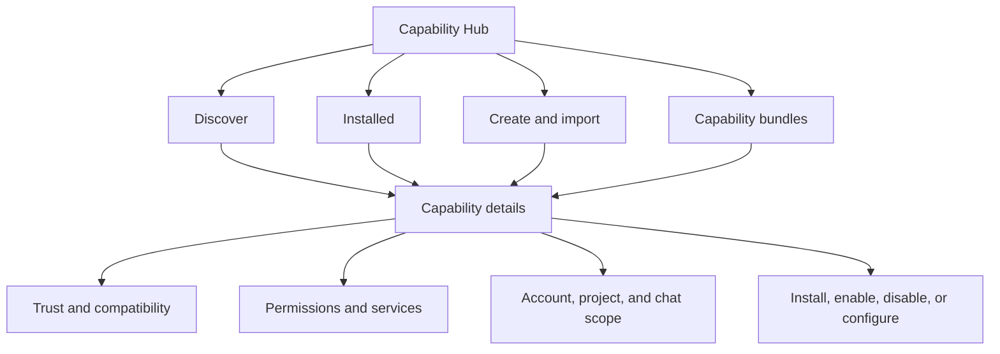
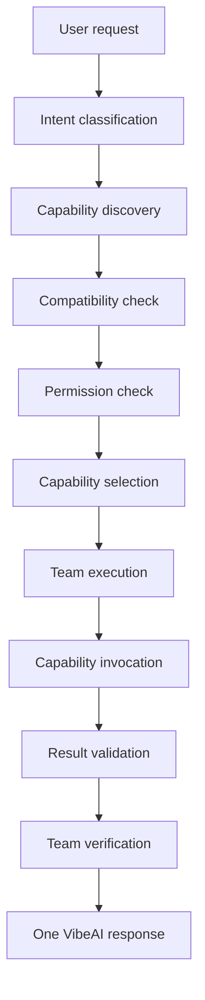
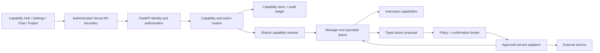
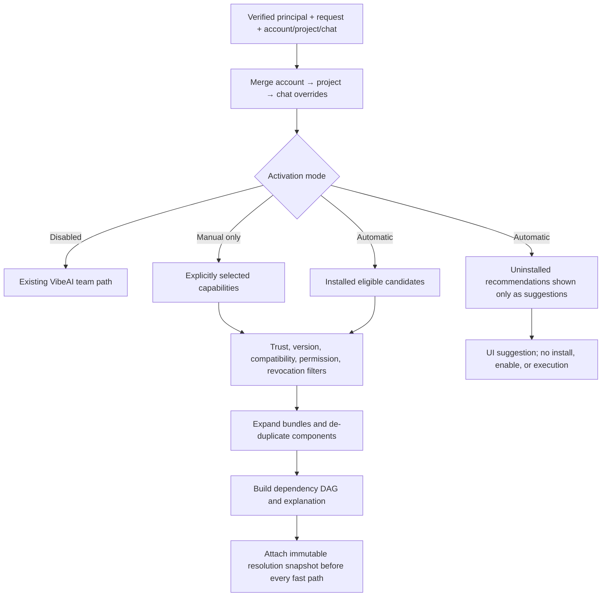
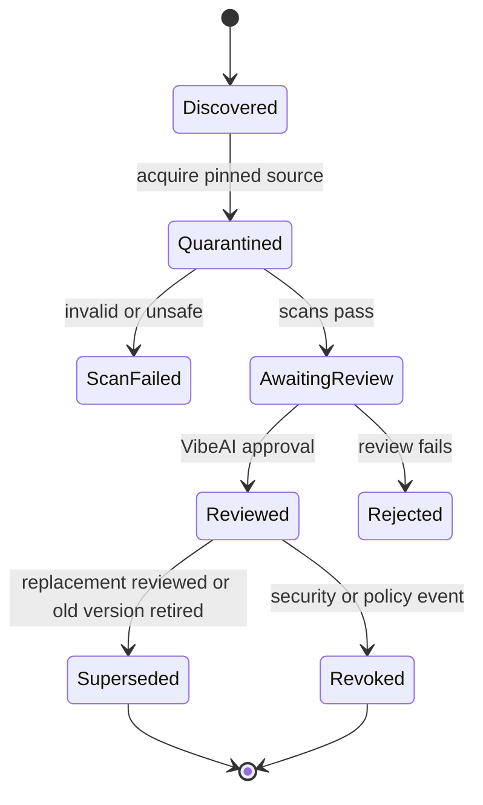
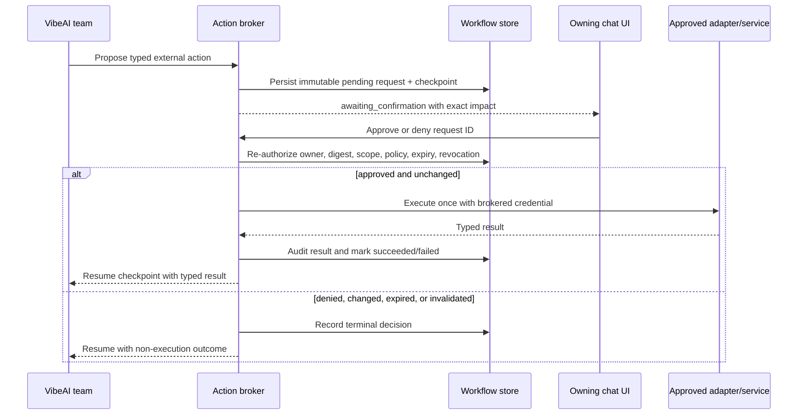

# VibeAI Capability Hub - Plan

> Product Contract preservation: behavior and scope are unchanged from the user-approved requirements artifact; one missing session-settlement annotation is restored, and the sections after it supply the implementation contract.

## Goal Capsule

- **Objective:** Add a unified capability layer through which users and VibeAI teams can discover, install, create, import, configure, and use reusable skills, reviewed plugins, compatibility adapters, and task-focused bundles.
- **Product authority:** The Product Contract in this document is the confirmed authority for capability behavior, scope, security, and compatibility.
- **Execution profile:** Cross-cutting software feature spanning the website, Manager, agent runtime, permissions, compatibility, review, and observability surfaces.
- **Open blockers:** None; the Product Contract's deferred how-level questions are resolved under Planning Contract → Resolved During Planning.
- **Scope boundary:** This plan owns the Capability Hub and its integration with existing VibeAI teams. Claude-specific workflows powered by the VibeAI backend are a later, separately planned area.

---

## Product Contract

### Summary

VibeAI will add a unified Capability Hub for built-in, user-created, imported, and reviewed GitHub capabilities.
Task-focused bundles will make capabilities approachable, while automatic orchestration will compose them inside the existing multi-team workflow.

### Problem Frame

VibeAI already routes work among specialist teams and has a small internal skill mechanism, but users cannot manage reusable skills or plugins as product-level objects.
Expanding each task category through hard-wired Manager behavior would increase coupling and make portability, user customization, and third-party integrations difficult.
Modern AI products also set an expectation that one workspace can support research, coding, writing, and multi-step work without forcing users to understand the internal subsystem responsible for each task.

### Key Decisions

- **One capability system with three product expressions.** The Capability Hub is the foundation, bundles provide agent-like task experiences, and automatic orchestration supplies the invisible composition layer. Governs R1-R7, R12. (session-settled: user-directed - chosen over Capability Hub alone: the bundle and automatic-composition strengths of the other approaches remain important.)
- **Sandboxed approved actions only.** Governs R14-R17. (session-settled: user-directed - chosen over arbitrary third-party code: security boundaries must remain non-negotiable.)
- **Hybrid activation with user control.** Governs R7-R9. (session-settled: user-directed - chosen over automatic-only or manual-only activation: users want intelligent assistance with a Settings toggle and direct overrides.)
- **Account defaults with project and chat overrides.** Governs R10-R11. (session-settled: user-directed - chosen over a single global or project-only scope: users need consistent defaults and local control.)
- **Confirmation before every external plugin action.** Governs R18-R20. (session-settled: user-directed - chosen over one-time or risk-tiered consent: the user prefers maximum visibility for plugin actions.)
- **Reviewed GitHub ecosystem.** Governs R21-R25. (session-settled: user-directed - chosen over automated-only or community-only approval: GitHub availability does not establish trust.)
- **Portable where accurate, explicit where incompatible.** Governs R26-R29. Claude-compatible structures are preferred, while adapters expose safe Claude and Codex interoperability without false parity. (session-settled: user-directed - chosen over claiming unchanged provider parity: unsafe or host-specific behavior must be adapted, disabled, replaced, or marked unsupported.)

### Actors

- A1. **Capability user:** Discovers, installs, creates, configures, enables, disables, and approves capabilities.
- A2. **Capability author:** Publishes a built-in, private, imported, or GitHub-sourced capability with declared behavior and permissions.
- A3. **VibeAI team:** Requests and uses capabilities during planning, execution, critique, verification, or synthesis.
- A4. **Capability Resolver:** Selects compatible and permitted capabilities for the current request and scope.
- A5. **Permission gateway:** Explains and gates every external plugin action before execution.
- A6. **Review pipeline:** Evaluates sourced packages and assigns visible trust and compatibility states.

### Requirements

**Unified capability experience**

- R1. Skills, plugins, integrations, adapters, and capability bundles must appear as forms of one Capability system rather than separate agent products.
- R2. The Capability Hub must let users discover, install, create, import, configure, enable, disable, and inspect capabilities.
- R3. Every capability must expose a standard manifest covering identity, version, source, type, supported tasks, activation, permissions, services, compatibility, runtime needs, dependencies, trust, review, risk, and configuration.
- R4. The initial release must support built-in VibeAI skills, user-created skills, imported compatible skills, reviewed GitHub plugins, provider adapters, and capability bundles.
- R5. Capability bundles must combine skills, plugins, instructions, and configuration around a job without creating independent agent systems.
- R6. The initial ecosystem must demonstrate research, coding, professional writing, and mixed research-to-creation workflows while remaining extensible to additional task families.

**Resolution and team behavior**

- R7. The Capability Resolver must use user intent, active project, conversation context, requested task, installed capabilities, compatibility, and permission state when recommending or activating capabilities.
- R8. Users must be able to select Automatic, Manual only, or Disabled activation in Settings.
- R9. Users must be able to accept, reject, enable, or disable capability suggestions during a chat without changing unrelated scopes.
- R10. Capability configuration must resolve from account defaults to project overrides to chat overrides, with the most specific scope winning.
- R11. Multiple capabilities may be composed when the request requires them, subject to compatibility and permission checks.
- R12. Existing VibeAI teams must remain responsible for classification, planning, parallel execution, critique, refinement, verification, and synthesis.
- R13. A VibeAI team may request a capability, and the resulting work may be reviewed by other teams before it reaches the final answer.

**Security and consent**

- R14. Third-party plugins must execute only sandboxed actions exposed through approved VibeAI interfaces.
- R15. A capability must declare its required permissions, external services, shared information, mutable resources, and risk class before installation or execution.
- R16. A capability must be denied access to operating-system resources, files, networks, credentials, plugins, and user data unless its approved contract exposes that resource.
- R17. External plugin actions must pass through the VibeAI permission gateway.
- R18. Every external plugin action must receive explicit user confirmation before execution.
- R19. Confirmation must identify the requesting capability, action, affected service or resource, information shared, and information that may be modified.
- R20. Internal instructional skills may run automatically when the active scope and activation mode permit them.

**GitHub trust and review**

- R21. A GitHub repository must not become trusted or normally installable solely because it is publicly available.
- R22. GitHub-sourced capabilities must pass manifest, dependency, permission, network, secret, malicious-pattern, compatibility, and sandbox checks before VibeAI review can approve them.
- R23. The Hub must display a trust state that distinguishes VibeAI Built-in, VibeAI Reviewed, Community Source, User Imported, and Unsupported capabilities.
- R24. Users must be able to see review, trust, permission, compatibility, and risk information before installing or enabling a capability.
- R25. The initial release must not expose an unrestricted public marketplace of unreviewed capabilities.

**Provider compatibility**

- R26. Native VibeAI instruction skills must preserve Claude-compatible skill structure where doing so remains accurate and safe.
- R27. Compatibility adapters must support Claude-compatible skills, Codex-compatible packages, and native VibeAI capabilities.
- R28. Provider-specific behavior that cannot operate safely or correctly must be adapted, disabled, replaced with a VibeAI equivalent, or marked unsupported.
- R29. Compatibility messaging must not imply that imported provider packages behave identically when they do not.

### Capability Hub Surface



The layout illustrates R2-R4, R10, and R23-R24; those requirements remain the normative behavior.

### Capability Resolution Flow



The diagram illustrates R7, R11-R13, and R17; those requirements remain the normative behavior.

### Key Flows

- F1. GitHub capability installation
  - **Trigger:** A1 chooses a GitHub-sourced package.
  - **Actors:** A1, A2, A6
  - **Steps:** The Hub shows source and declared behavior, the review pipeline establishes compatibility and trust, and the user approves installation settings.
  - **Outcome:** The capability is installed with a visible trust state or rejected with an actionable reason.
  - **Covers:** R2-R4, R15, R21-R25
- F2. Automatic capability composition
  - **Trigger:** A1 submits a request while Automatic activation is enabled.
  - **Actors:** A1, A3, A4
  - **Steps:** The resolver finds permitted candidates, composes compatible capabilities, and passes their outputs through the existing team workflow.
  - **Outcome:** The user receives one verified VibeAI response without manually assembling the workflow.
  - **Covers:** R7-R13
- F3. External plugin action
  - **Trigger:** A selected plugin requests an external action.
  - **Actors:** A1, A3, A5
  - **Steps:** The gateway explains the action and data impact, waits for confirmation, then permits or denies the approved interface call.
  - **Outcome:** Nothing external executes without the user's decision.
  - **Covers:** R14-R20
- F4. Provider package import
  - **Trigger:** A1 imports a Claude- or Codex-compatible package.
  - **Actors:** A1, A4, A6
  - **Steps:** VibeAI translates supported behavior, identifies incompatibilities, and presents the resulting capability contract before activation.
  - **Outcome:** Supported parts work through VibeAI while unsupported behavior remains visible.
  - **Covers:** R3, R15, R26-R29

### Acceptance Examples

- AE1. Automatic research bundle
  - **Covers:** R6-R13
  - **Given:** Automatic activation is enabled and the research capabilities are installed.
  - **When:** The user asks for a cited comparison requiring discovery, analysis, and writing.
  - **Then:** VibeAI composes the relevant capabilities and teams into one reviewed answer without requiring manual routing.
- AE2. Chat-level override
  - **Covers:** R8-R10
  - **Given:** A capability is enabled by the account default.
  - **When:** The user disables it for the active chat.
  - **Then:** It remains available elsewhere but is neither suggested nor activated in that chat.
- AE3. Confirmed external write
  - **Covers:** R17-R19
  - **Given:** A plugin wants to modify an external GitHub issue.
  - **When:** The action reaches the permission gateway.
  - **Then:** The issue is not modified until the user sees the affected resource and shared data and explicitly confirms.
- AE4. Rejected malicious package
  - **Covers:** R14-R16, R21-R25
  - **Given:** A GitHub package requests undeclared credential or filesystem access.
  - **When:** It passes through review or execution enforcement.
  - **Then:** VibeAI blocks the access and does not grant the package a normally installable reviewed state.
- AE5. Partial provider compatibility
  - **Covers:** R26-R29
  - **Given:** An imported package contains supported instructions and an unsupported provider-specific hook.
  - **When:** VibeAI evaluates the package.
  - **Then:** The instructions may be imported while the hook is disabled or replaced and visibly reported as incompatible.

### Success Criteria

- Users can complete the representative workflow families in R6 without learning VibeAI's internal team topology.
- Capability selection produces one coherent response whose externally sourced work remains subject to R12-R13 verification.
- Scope resolution behaves predictably according to R10.
- No external plugin action occurs before the confirmation required by R18-R19.
- Imported packages never fail silently when provider-specific behavior is unsupported under R28-R29.
- A rapid prototype may demonstrate the whole direction, but production readiness requires validated security boundaries for every approved action path.

### Scope Boundaries

**Deferred for later**

- The separate architecture through which the VibeAI backend enhances Claude-specific workflows.
- An unrestricted public marketplace for community packages.
- Broader compatibility beyond the initial VibeAI, Claude, and Codex package families.

**Outside this product's identity**

- Arbitrary third-party code execution, excluded by R14.
- Unlimited operating-system or credential access, excluded by R16.
- Automatic trust of GitHub repositories, excluded by R21-R25.
- Silent execution of external plugin actions, excluded by R18-R19.
- Replacement of VibeAI's specialist team architecture with separately installed agents, excluded by R5 and R12.
- A guarantee that every third-party or provider-specific package works unchanged, excluded by R28-R29.

<!-- ce-section: work-relationships -->
### How This Work Fits Together

This plan owns the Capability Hub and its integration with the current VibeAI workflow. The broader breakdown is contextual rather than a committed roadmap.

- **Current area:** Capability Hub
  - **Enables:** Later Claude-specific workflows to call reviewed VibeAI capabilities through a stable capability contract.
  - **Shares:** Existing Manager routing, specialist teams, memory, search, and verification behavior.
- **Later candidate:** Backend-assisted Claude workflows
  - **Depends on:** A trustworthy capability manifest, resolver, permission gateway, and compatibility model from this plan.
  - **Still to decide:** The Claude-facing product surface, transport, authentication, and execution boundary.

### Dependencies and Assumptions

- The current model-and-team registry remains distinct from the new skill-and-plugin capability registry unless implementation planning identifies a safe shared presentation layer.
- The existing agent tool executor is not a security sandbox for third-party packages; its shell execution is explicitly best-effort containment, so R14-R19 require a new enforceable boundary.
- Existing VibeAI authentication, account identity, project identity, and chat identity can supply the scope subjects required by R10.
- Capability review states require durable provenance from source through installation and execution.
- Security validation takes priority over an artificial one-day production deadline, although internal milestones may deliver one unified release.

### Outstanding Questions

**Deferred to Planning**

- Which serialization and validation format should implement the capability manifest while preserving provider compatibility?
- What isolation mechanism can enforce the approved-action boundary independently of the existing shell-capable agent executor?
- Which review checks run automatically, which require VibeAI approval, and what evidence changes each trust state?
- How should capability updates, revocation, rollback, and version conflicts behave?
- What Hub layout best explains installed capabilities, bundles, trust, scopes, and pending confirmations on desktop and mobile?
- Which internal milestones prove the unified release direction without presenting a prototype as production-ready?

### Sources and Research

- `core/skills.py` defines the existing curated, task-triggered internal skill representation and selection behavior.
- `core/agent_loop.py` injects selected internal skills into agent execution.
- `tools/agent_tools.py` defines the current agent tools and executor, including the documented limitation that shell containment is not a security boundary.
- `manager/claude_manager.py` routes work among active teams and synthesizes their outputs.
- `api/server.py`, `Neuronova-vibeaiwebsite/api/registry.js`, and `Neuronova-vibeaiwebsite/src/chat/RegistryPanel.jsx` provide an existing model-and-team registry, not a skill/plugin installation or permission lifecycle.

---

## Planning Contract

### Key Technical Decisions

1. **KTD1 — Introduce a separate capability domain and canonical manifest.** Create a `capabilities/` backend package with versioned, provider-neutral models for instruction skills, approved actions, external-service registrations, bundles, trust, compatibility, configuration, and provenance. Preserve each imported source manifest and content digest alongside the normalized manifest. Keep `core/skills.py` as the current built-in instructional source during migration rather than expanding it into an installation system. This realizes R1-R6 and avoids coupling third-party lifecycle state to static prompt helpers.
2. **KTD2 — Make the backend the authority for identity, ownership, scope, and security state.** The Vercel boundary will forward the signed-in user's short-lived Clerk session token; FastAPI will verify its signature, expiry, issuer/audience, and authorized party against configured Clerk keys/JWKS. The shared `VIBE_API_TOKEN` remains service authentication, not end-user authorization. Capability installations, scope overrides, reviews, actions, jobs, and audits are always owned and authorized by the verified principal. This corrects the Product Contract assumption that the current identity path already supplies trustworthy scope subjects and governs R2, R9-R10, R17-R19.
3. **KTD3 — Use one transactional store contract with SQLite for local tests and managed PostgreSQL in production.** Introduce SQLAlchemy 2 async models and Alembic expand/contract migrations for immutable capability versions, source evidence, author drafts, installations, tri-state scope overrides, review evidence, revocations, resolver decisions, pending actions, executions, service connections, and audit events. Local/test profiles may bind SQLite; deployed profiles must bind managed PostgreSQL so atomic unique constraints, row locking, compare-and-set transitions, and execution leases work across workers. Account owns installation; project/chat scopes control activation and configuration. Every record carries owner and immutable provenance. Service-connection rows contain only opaque credential references. The initial credential store uses per-record AES-256-GCM envelope encryption with versioned master keys supplied by deployment secrets, authenticated metadata binding owner/provider/connection, and explicit rotation, refresh, revocation, environment separation, and backup-restore tests; plaintext never enters the capability tables.
4. **KTD4 — Resolve capabilities once, before every Manager fast path.** A shared deterministic resolver runs before creative and fast-path handling in `manager/claude_manager.py`, and its result is the single source for UI explanations, Manager context, and agent invocation. The versioned activation contract uses a normalized task taxonomy, declarative intent/task tags, explicit triggers, required features, priority, exclusions/conflicts, stable tie-breakers, and match provenance; deterministic application rules—not model prose—own eligibility/order. A model classifier may contribute a version-pinned, recorded feature input but cannot grant authority or silently change policy. Resolution merges account → project → chat using `inherit | enabled | disabled` plus configuration patches; filters by installation, trust, compatibility, permissions, revocation, and activation mode; expands bundles; de-duplicates members; then builds a dependency DAG. Automatic may recommend uninstalled items but never installs or enables them. Manual-only uses explicit selections; Disabled neither suggests nor runs. New accounts start in Automatic for installed internal instructional capabilities; existing accounts migrate to Manual-only until the user accepts Capability Hub onboarding, preventing surprise behavior. No eligible capability falls back to the existing VibeAI team behavior.
5. **KTD5 — Treat imported packages and instructions as untrusted data, never executable authority.** Discovery and review may read only bounded declarative files and passive assets. No package script, hook, binary, dependency lifecycle, provider substitution, hidden download, shell command, raw socket, or arbitrary MCP configuration executes during import, review, installation, or use. VibeAI's stricter portable profile requires explicit `name` and `description` even where Claude may infer or merely recommend them. Imported instructions are bounded context that cannot grant tools or permissions, override VibeAI policy/system instructions, disclose unrelated context, obtain credentials, or convert a suggestion into an external effect. Provider-only behavior becomes an adapter report entry: `native`, `adapted`, `disabled`, `unsupported`, or `rejected`. This enforces R14-R16 and R26-R29.
6. **KTD6 — Bind trust to an immutable reviewed version and privileged reviewer decision.** A GitHub candidate is acquired at a full commit SHA and content digest, scanned in quarantine, then reviewed with manifest, dependency, permission, network, secret, malicious-pattern, adapter, and compatibility evidence. The lifecycle is `discovered → quarantined → scan_failed | awaiting_review → reviewed | rejected → superseded | revoked`. Only an authorized VibeAI reviewer may approve the exact quarantined digest/evidence set after recent step-up authentication; an ordinary user cannot self-promote it. Reviewer membership is server-controlled, least-privilege, admin-granted/revoked, rechecked at decision time, and audited independently from package evidence. Source, dependency, permission, adapter, or content changes create a new candidate. Revocation prevents every not-yet-dispatched action, immediately disables effective scopes, and invalidates pending approvals; an action already dispatched externally is cancellation-best-effort and ends in an auditable `cancelled` or `outcome_unknown` state rather than being reported as prevented.
7. **KTD7 — Replace “plugin execution” with a server-owned approved-action broker.** Imported capabilities can propose only typed, allowlisted operations implemented by VibeAI adapters. They cannot call the existing generic `ToolExecutor`, shell executor, or broad GitHub dispatcher. Each external service connection is owner-bound to the verified VibeAI principal, external installation/account identity, immutable target-resource IDs, allowed operations, and credential expiry/revocation state; aliases or renamed resources never widen it. The broker validates schemas and policy, mediates secrets with minimum-scope credentials, enforces HTTPS destination/redirect allowlists and SSRF protections, pins a reviewed provider API version, applies rate limits/timeouts, and fails closed. A capability never receives raw credentials or unrestricted network/file access. This is the enforceable meaning of “sandboxed approved actions” in R14-R17.
8. **KTD8 — Use a durable exact-action confirmation and resume protocol.** Each external proposal creates an immutable action request containing owner/scope, service connection and external identity, capability version digest, operation, target, observed remote-state fingerprint or conflict-safe operation class, redacted structured arguments and digest, disclosed data classes, mutable effects, expiry, dependency links, and idempotency key. The lifecycle is `pending → approved | denied | expired | invalidated → executing → succeeded | failed | cancelled | outcome_unknown`. Approval authorizes exactly one unchanged request; policy, scope, service connection, enabled state, revocation, payload, destination, remote state, and expiry are rechecked immediately before execution. Duplicate approvals are idempotent and only one worker may acquire the execution lease. The worker commits a monotonic send-attempt marker before network I/O; a crash before that marker is safely reclaimable, while every post-marker crash becomes `outcome_unknown` unless the provider supplies a verified idempotency/precondition contract. Non-idempotent writes are never retried automatically. The v1 GitHub write is an append-only issue comment bound to immutable repository/issue IDs and a fresh issue-state check; destructive or overwriting operations without safe remote preconditions are rejected.
9. **KTD9 — Suspend and resume orchestration on a PostgreSQL outbox worker instead of holding an HTTP request open.** Extend capability-aware prompt/job responses to return either a completed answer or an `awaiting_confirmation` checkpoint. A PostgreSQL-backed outbox/worker claims jobs with row locking, heartbeats ownership, wakes on approvals/results, recovers dead workers, and commits checkpoint/outbox transitions atomically. Existing in-memory Manager/project jobs bridge into this durable path before the first capability checkpoint; ordinary non-capability jobs may retain the legacy path. The checkpoint is a versioned, bounded, owner-bound workflow model containing selected IDs, dependency state, redacted/classified references, and resume metadata—not credentials, bearer tokens, arbitrary package data, or unbounded prompts/tool transcripts. Independent work may finish; dependents of a denied, failed, expired, revoked, or unknown prerequisite are skipped and the final answer names material omissions. Existing team critique, verification, and synthesis remain downstream owners under R12-R13.
10. **KTD10 — Build the Hub as a backend-driven product surface, not an extension of the model registry.** Add a dedicated Capability Hub route/panel with discover, installed, bundles, create/import, detail, trust, compatibility, permissions, scope provenance, and activity views. Settings owns account activation defaults; project and chat surfaces own overrides and suggestions. Desktop can use a split catalog/detail layout; mobile uses searchable cards and full-screen detail/confirmation sheets so install, scope, approve, and deny actions never depend on horizontal tables.
11. **KTD11 — Keep bundles declarative and versioned.** A bundle expands into pinned component capabilities before eligibility checking and has no executor. Installation is atomic for required components; an unsupported or revoked required component disables the bundle. Explicitly optional members may be skipped with visible degraded-state provenance. Bundle/member configuration precedence and de-duplication are visible.
12. **KTD12 — Ship capability families through the same contracts as imports.** Research Analyst, Software Engineering, Content Studio, and Research-to-Creation bundles are seeded as reviewed VibeAI-owned manifests, not Manager special cases. Their instruction skills may activate automatically, while every external read or mutation still passes through the same broker and per-action consent path. This proves R6 without creating a second runtime.

### High-Level Technical Design

These sketches establish boundaries and protocols; exact class names and payload fields may be refined while preserving the KTDs and Product Contract.

#### Component architecture



#### Scope and resolution decision flow



#### GitHub import and trust lifecycle



#### Exact-action confirmation and resume sequence



### Canonical Data and API Contracts

- **CapabilityVersion:** immutable identity, semantic/source version, content digest, normalized manifest, original provider manifest, passive assets, adapter/schema versions, source provenance, trust/review state, and compatibility report.
- **Installation and ScopeOverride:** account-owned installation plus `inherit | enabled | disabled` state and configuration patch at account, project, and chat scope; resolved snapshots record provenance for every winning value.
- **SuggestionDecision:** owner-bound request/chat record distinguishing one-time Accept, suggestion-only Reject, and explicit chat Enable/Disable overrides so UI dismissal cannot silently become persistent activation policy.
- **ReviewEvidence:** source revision/digests, scan findings, declared/observed permissions and services, dependency/SBOM evidence, reviewer/decision, timestamps, supersession, and revocation reason. Raw imports remain in an encrypted reviewer-only quarantine, never the canonical database; terminal review deletes raw archives after extracting required digests/redacted evidence, while pending imports expire under a bounded TTL. Likely live-secret findings trigger a credential-exposure response rather than passive retention.
- **ResolutionSnapshot:** activation-contract version, normalized request/task features and their extractor/classifier provenance, activation mode, eligible/rejected candidates with trigger/priority/conflict/tie-break reasons, expanded bundle graph, selected capability versions, configuration, and policy snapshot passed identically to UI and runtime.
- **ActionRequest and Execution:** exact immutable action contract from KTD8, status transitions, idempotency, typed result/error, checkpoint linkage, and redacted audit references.
- **API families:** capability discovery/detail/create/new-version/import/install/configuration/scope/review/revoke/resolve-preview; pending-action list/detail/approve/deny; workflow resume/status; audit/activity. Every handler derives ownership from verified identity and authorizes account/project/chat/job relationships server-side.
- **Compatibility contract:** VibeAI's native import profile requires explicit portable `name`, `description`, Markdown instructions, and bounded passive references, even where a source host would infer an omitted field. Claude/Codex plugin manifests remain provenance inputs, not VibeAI's canonical schema. In v1, every MCP declaration imports only as a disabled, non-resolver-eligible external-service candidate. A future Streamable-HTTP adapter must separately pass the current MCP authorization/transport suite—Protected Resource Metadata, OAuth/OIDC discovery, PKCE, resource-audience binding, scope step-up, token non-passthrough, Origin validation, and DNS-rebinding defenses—before any MCP capability may activate.

### External Action UX State Contract

| State | Visible behavior and controls | Recovery / accessibility |
|---|---|---|
| `pending` | Exact immutable impact plus separate Approve and Deny; never bulk-approvable | Initial focus on heading, trapped sheet focus, status announced; user may leave and reopen from inbox |
| `approved` | Decision receipt; approval controls disabled while lease is acquired | Announce transition and retain owning chat/project link |
| `denied` | No service call; show skipped dependency impact | Final for this request; a materially new proposal is required |
| `expired` / `invalidated` | Approval disabled with expiry/change/revocation reason and diff where applicable | Offer creation of a new request, never reuse the old approval |
| `executing` | Non-interactive progress state; no repeat approval/retry | Live status announcement without stealing focus |
| `succeeded` | Durable result receipt and affected resource link | Resume dependent verification/synthesis and restore focus |
| `failed` | Known non-effect or known failure with safe next step | Never automatically retry a non-idempotent action |
| `cancelled` | Cancellation outcome and any known provider state | Resume only work that does not depend on the cancelled result |
| `outcome_unknown` | Prominent reconciliation-required state; no retry control or success claim | Provide provider-resource inspection/manual reconciliation, block dependent success, preserve audit |

### Output Structure

```text
capabilities/
  models.py                 # canonical manifests, lifecycle enums, scope/action records
  manifests.py              # versioned validation and passive asset rules
  store.py                  # transactional persistence and migrations
  credentials.py            # envelope-encrypted service credential boundary
  registry.py               # discovery/install/update/revoke service
  resolver.py               # scope merge, eligibility, bundles, DAG, explanations
  review.py                 # acquisition, scans, evidence, trust lifecycle
  actions.py                # typed approved-action definitions and policy checks
  broker.py                 # confirmations, execution, resume, audit
  worker.py                 # PostgreSQL outbox, leases, heartbeats, recovery
  adapters/
    claude.py               # Claude skill/plugin conversion report
    codex.py                # Codex skill/plugin conversion report
    mcp.py                  # disabled-by-default service candidate conversion
  builtins/                 # VibeAI manifests and task bundles
api/
  identity.py               # verified Clerk principal and ownership guards
  capabilities.py           # capability/review/scope endpoints
  actions.py                # confirmation, execution, resume endpoints
Neuronova-vibeaiwebsite/src/chat/capabilities/
  CapabilityHub.jsx
  CapabilityDetail.jsx
  CapabilityScopeControls.jsx
  CapabilityActivity.jsx
  ActionConfirmation.jsx
  capabilityApi.js
```

### Assumptions

- The approved Product Contract is the behavioral authority. Inferred technical defaults are recorded here because the user waived another scoping confirmation.
- The existing Vercel Clerk middleware remains the browser authentication entry point, but FastAPI must independently verify the forwarded session token; browser-provided user, project, chat, action, and job identifiers are never authorization evidence.
- Account installation and scope overrides are server-owned. Existing localStorage project/chat/settings records may be migrated or used as display caches, but security and execution never depend on them.
- Local development/tests may use SQLite through the shared SQLAlchemy store. Production uses managed PostgreSQL with a successful migration, restart, concurrency, backup, and rollback preflight; ephemeral serverless storage and production SQLite are not accepted.
- External integrations begin with the smallest useful reviewed adapter set, with GitHub issue read/write as the representative confirmation path. The action registry is extensible, but arbitrary shell, arbitrary HTTP, provider hooks, and raw stdio remain unsupported.
- Automatic selection remains explainable and deterministic; no model-generated text can grant permissions, choose destinations outside policy, or bypass trust/confirmation checks.
- No relevant institutional learnings were found under `docs/solutions/`. Reusable lessons from this implementation should be captured after delivery.

### Sequencing and Migration

1. Establish canonical models, migrations, durable identity, and ownership before exposing mutation routes.
2. Add registry/import/review lifecycle while every non-built-in executable capability remains disabled.
3. Add deterministic resolver and wire its snapshot before all Manager paths; preserve the old team fallback.
4. Add a read-only Hub preview, settings, project/chat overrides, suggestions, and passive built-in families so users can validate discovery and scoped internal composition before external actions ship.
5. Add approved actions, durable confirmation/resume, and audit with a single reviewed GitHub adapter.
6. Add mobile confirmation recovery, external-action activity, and action-capable bundle fixtures; enable external composition only after security, authorization, and recovery gates pass.
7. Run a preview rollout with read-only/internal capabilities first, then the confirmed external adapter, then broader reviewed packages. Revocation and rollback remain available at every stage.

### Resolved During Planning

- **Manifest format:** provider-neutral, versioned VibeAI schema with original manifests retained; portable `SKILL.md` is the direct interchange subset (KTD1, KTD5).
- **Isolation:** declarative packages plus a typed server-owned action broker; the existing shell-capable executor is explicitly out of boundary (KTD7).
- **Review split:** automated quarantine/scans produce immutable evidence; a VibeAI decision promotes a version to reviewed; neither step alone grants runtime access (KTD6).
- **Updates/revocation:** every material change creates a new reviewed version; revocation overlays are checked per invocation and invalidate pending work (KTD6, KTD8).
- **Hub information architecture:** dedicated responsive Hub plus Settings/project/chat integrations; not the model registry table (KTD10).
- **Milestone proof:** foundation → review/resolution → confirmed action → complete UI/bundles → staged release; the production gate is security evidence, not elapsed time.

### Deferred to Follow-Up Work

- Backend-assisted Claude workflows remain outside this plan as specified by the Product Contract.
- Additional external service adapters beyond the representative GitHub flow are follow-on units that reuse the broker contract.
- A public community marketplace, provider-specific executable hooks, arbitrary code packages, local stdio MCP, legacy HTTP+SSE MCP, browser extensions, LSP, monitors, and scheduled templates remain unsupported until separately specified and threat-modeled.

## Implementation Units

### U1. Canonical capability domain and durable store

- **Goal:** Establish versioned capability, scope, trust, workflow, and audit primitives that every later unit shares.
- **Requirements:** R1-R6, R10, R15, R23-R24; supports F1 and F4.
- **Dependencies:** None.
- **Files:** Add `capabilities/models.py`, `capabilities/manifests.py`, `capabilities/store.py`, `capabilities/credentials.py`, `capabilities/registry.py`, `capabilities/__init__.py`, `capabilities/builtins/`, `migrations/`; update `core/state.py`, `config/settings.py`, `requirements.txt`; add `tests/capabilities/test_manifests.py`, `tests/capabilities/test_store.py`, `tests/capabilities/test_credentials.py`, `tests/capabilities/test_registry.py`, `tests/capabilities/fixtures/`.
- **Approach:** Define strict schema-versioned manifests and lifecycle enums from KTD1, KTD3, KTD6, KTD11. Add SQLAlchemy async persistence, idempotent Alembic expand/contract migrations, and transaction boundaries for immutable versions, editable account-owned author drafts, installation/scope records, review evidence, action/workflow state, execution leases, service connections, and append-only redacted audit events. Create the canonical registry service for discovery, installation, and immutable version transitions. A user draft validates/previews without becoming executable; publish creates an immutable User Imported version, editing creates a new draft/version, and archive prevents new resolution while preserving required history. Preserve source bytes/digests without evaluating them. Add built-in manifest fixtures while leaving current skill behavior intact.
- **Patterns:** Preserve `core/state.py`'s asynchronous service boundary and repository Pydantic conventions, but centralize new capability persistence through SQLAlchemy async sessions and Alembic rather than duplicating one-connection-per-operation SQLite code. Keep local SQLite and production PostgreSQL behavior covered by the same store contract tests.
- **Test scenarios:** valid native manifest round-trip; author draft validate/preview/publish/edit-as-new-version/archive lifecycle; credential encrypt/decrypt, authenticated-owner/provider binding, wrong-key/tamper rejection, key rotation, revocation, environment separation, backup restore, and plaintext non-persistence; unknown critical field rejection; manifest/schema version mismatch; path traversal, absolute path, symlink escape, case-fold collision, oversized file, secret interpolation, binary/script, and duplicate-name rejection; concurrent install/scope writes remain consistent on PostgreSQL; SQLite/PostgreSQL contract parity; migration re-run is safe; audit records contain hashes/classifications rather than secrets.
- **Verification:** Focused manifest/store tests pass from a fresh database and an upgraded database fixture; schema inspection shows all owner/provenance constraints and indexes; no source file is executed or fetched during parsing.

### U2. Trusted identity, ownership, and capability APIs

- **Goal:** Make account/project/chat/job ownership enforceable end-to-end and expose authenticated capability state APIs.
- **Requirements:** R2-R4, R8-R10, R17-R19, R24; supports F1-F4 and AE2-AE3.
- **Dependencies:** U1.
- **Files:** Add `api/identity.py`, `api/capabilities.py`, `api/actions.py`, `api/integrations.py`; update `api/server.py`, `Neuronova-vibeaiwebsite/api/_lib/clerkAuth.js`, `Neuronova-vibeaiwebsite/api/_lib/requestData.js`, `Neuronova-vibeaiwebsite/api/team.js`, `Neuronova-vibeaiwebsite/api/project.js`; add `Neuronova-vibeaiwebsite/api/capabilities.js`, `Neuronova-vibeaiwebsite/api/actions.js`, `Neuronova-vibeaiwebsite/api/integrations.js`, `tests/capabilities/test_identity_api.py`, `tests/capabilities/test_service_connections.py`, and extend `tests/test_api_jobs.py`.
- **Approach:** Implement KTD2: forward the current session token through the trusted proxy and verify it in FastAPI with `PyJWT[crypto]`, cached Clerk JWKS/public keys, fixed algorithms, issuer/audience/authorized-party checks, expiry/not-before validation, bounded clock skew, and safe key rotation refresh. Add server-authoritative project/chat scope registration and ownership: browser-created local entities are registered/imported under the verified account before capability state can reference them; deletion invalidates new use, disables their overrides, and denies or invalidates owning pending actions while retaining required audit history. Bind every capability, project, chat, job, service connection, action, resume, review, and audit query to the verified subject and server-validated ownership. Add draft validate/preview, publish immutable version, edit-as-new-version, archive, and delete-eligible-draft APIs for declarative user-authored instruction skills. Add a GitHub App installation flow with signed state/callback validation, verified account/installation ownership, immutable repository selection, short-lived token minting, refresh/rotation/revocation/disconnect, and status APIs; only opaque secret references enter the store. Bootstrap the first admin/reviewer only from deployment-secret user IDs into audited server-side role records, then disable the one-time bootstrap path; subsequent grants/revocations require an admin with recent MFA/reauthentication, narrow role scope, and decision-time revalidation. Keep the shared backend token as an additional service boundary. Vercel proxy handlers dispatch only an allowlisted operation/resource set and never accept a user-supplied upstream URL. Expose pagination, structured validation errors, and idempotency for mutation routes.
- **Patterns:** Reuse Vercel request/auth helpers and FastAPI dependency injection; replace hashed `user_id` as authorization with a verified principal while retaining a stable derived namespace only where memory isolation needs it.
- **Test scenarios:** valid, expired, wrong-issuer, wrong-audience, wrong-authorized-party, and missing JWT; service token without a user token cannot mutate user state; user A cannot view/install/configure/approve/resume/revoke user B's capability/action/job/service connection; GitHub callback state, installation ownership, repository grants, refresh, disconnect, and revoked credentials are enforced; create/import/reconnect/delete project and chat scopes from a fresh browser session; copied or fake IDs are rejected; deleting a scope with a pending action invalidates it without erasing audit; forged, expired, recently revoked, insufficient-scope, or non-step-up reviewer authority cannot transition trust; duplicate mutation key returns the original outcome; plaintext credentials never enter SQLite/PostgreSQL, logs, prompts, audits, backups, or API responses.
- **Verification:** Backend auth/API tests pass with local JWKS fixtures; existing authenticated chat/project proxy tests remain green; an integration test proves ownership on create, list, poll, approve, resume, and revoke paths.

### U3. Safe import adapters and reviewed GitHub lifecycle

- **Goal:** Import portable Claude/Codex skills and reviewed GitHub packages without executing untrusted content.
- **Requirements:** R3-R4, R14-R16, R21-R29; realizes F1, F4 and AE4-AE5.
- **Dependencies:** U1, U2.
- **Files:** Add `capabilities/review.py`, `capabilities/adapters/claude.py`, `capabilities/adapters/codex.py`, `capabilities/adapters/mcp.py`, `capabilities/adapters/__init__.py`; add `tests/capabilities/test_import_security.py`, `tests/capabilities/test_provider_adapters.py`, `tests/capabilities/test_review_lifecycle.py`, and provider fixtures under `tests/capabilities/fixtures/providers/`.
- **Approach:** Implement KTD5-KTD6. Acquire repositories without checkout hooks at an immutable commit into encrypted, access-controlled quarantine; hash the archive/tree, manifest, dependency declarations, and passive assets; parse only allowlisted paths and formats under per-principal/global quotas, bounded queues/concurrency, decompressed-byte/file-count/nesting limits, storage quotas, and cancellation/backpressure. Suppress duplicate work by digest and generate a per-component conversion report. Record provider, source-host/runtime version when known, and adapter version without assuming cross-provider semantics. Scan declared/observed permissions, dependencies, network endpoints, embedded secrets, unsafe paths, executables, substitutions, deceptive consent text, and malicious instruction patterns. Require an authorized reviewer to bind the exact evidence set and digest to a version-specific decision before installation. Delete raw terminal artifacts per the quarantine policy, retain redacted evidence/digests, re-review on source, dependency, permission, manifest, or adapter changes, and support supersede, rollback to a still-reviewed version, and revocation with the bounded dispatch semantics in KTD6.
- **Patterns:** Treat Claude/Codex manifests as adapters into KTD1, never as runtime contracts. Support minimal `SKILL.md`, passive resources, and read-only legacy Claude command conversion; mark Claude hooks/agents/bin/workflows/LSP/monitors and Codex hooks/apps/browser/scheduled behavior disabled or unsupported. Import MCP declarations as disabled service candidates only.
- **Test scenarios:** portable skill imports under VibeAI's explicit-metadata profile; missing Claude metadata is adapted/rejected rather than silently inferred; Claude-only and Codex-only fields receive explicit statuses/reasons; legacy `commands/`, post-v2.1.218 YAML booleans, provider-only Claude frontmatter, optional Claude autodiscovery, required Codex manifest, and Codex surface limitations produce version-aware reports; malformed YAML/JSON and ambiguous roots reject; archive traversal/symlink escape/hidden download/env substitution/executable/dependency lifecycle cannot cause filesystem, process, credential, or network side effects; policy-override/tool-grant/secret-exfiltration/deceptive-consent instructions cannot change authority; a flood of individually valid bounded imports hits per-user/global rate, queue, storage, and duplicate-digest controls without exhausting workers; raw archives expire/delete and likely-live-secret findings trigger response; every MCP declaration remains disabled and unreachable by resolver/runtime; an ordinary user cannot review; an authorized reviewer can approve only the exact evidence/digest; changed digest cannot inherit trust; revoked version disappears from eligibility and invalidates pending actions.
- **Verification:** Provider fixture matrix and hostile archive suite pass in an isolated temp directory with process/network spies; review-state transition tests prohibit skipped states. GitHub-sourced and external-action capabilities install only at an exact reviewed digest; validated declarative user-created/imported instruction capabilities may install under the visible User Imported trust state with actions and provider hooks disabled.

### U4. Deterministic resolver and team/agent integration

- **Goal:** Select, explain, compose, and inject capabilities consistently before every VibeAI execution path.
- **Requirements:** R5-R13, R20, R26-R29; realizes F2 and AE1-AE2.
- **Dependencies:** U1-U3.
- **Files:** Add `capabilities/resolver.py`, `capabilities/context.py`; update `manager/claude_manager.py`, `core/agent_loop.py`, `core/skills.py`, `manager/intent_contract.py`, `Neuronova-vibeaiwebsite/src/chat/engine.js`, `Neuronova-vibeaiwebsite/api/team.js`; add `tests/capabilities/test_resolver.py`, `tests/capabilities/test_manager_integration.py`, extend `tests/test_core_logic.py`, and extend `Neuronova-vibeaiwebsite/tests/chat-engine.test.js`.
- **Approach:** Implement KTD4, KTD9, KTD11. Resolve from a server-owned scope snapshot before creative/fast-path checks. Capability-eligible turns use a backend response contract that carries authoritative account/project/chat scope plus snapshot/version IDs and returns `completed` or `awaiting_confirmation`. Make eligibility and ordering deterministic and explain every selected/rejected candidate. Expand bundles, pin versions, merge configuration, de-duplicate components, and build a dependency DAG. Inject only bounded instructions/passive context into existing teams. Record per-capability outcomes and keep team critique/verification/synthesis as the final quality gate. Expose the same resolve-preview result to UI and agents. If the capability-aware backend is unavailable, mark capabilities unavailable for that turn and use the existing fallback with an explanation; no preview/suggestion may imply that a fallback executed capabilities.
- **Patterns:** Preserve the current Manager dispatch and `AgentLoop` skill-context patterns, but replace independent regex-only selection with a shared snapshot; keep old behavior as the no-candidate fallback.
- **Test scenarios:** account/project/chat precedence including explicit disabled vs inherit; Automatic, Manual-only, and Disabled semantics; versioned feature extraction, trigger/priority/conflict rules, and stable tie-breakers produce repeatable explanations; model-classifier drift cannot silently change policy; accepted/rejected suggestion records affect only their specified request/chat behavior; uninstalled recommendations never auto-install; incompatible/revoked/unreviewed candidates are explained and skipped; bundle pinning/de-duplication/config conflicts; partial DAG failure skips only dependents; two independent capabilities continue; creative and fast paths receive the same capability context; UI preview and runtime snapshot match exactly; live Manager, proxy Manager, local Omni, and `/api/chat` fallback paths either consume the same snapshot or prove capabilities did not execute; a selected capability plus Manager outage produces an explicit non-capability fallback.
- **Verification:** Resolver unit tests are deterministic across runs; Manager integration tests cover normal, creative, and fast routes; existing team routing/synthesis tests pass unchanged when no capabilities are eligible.

### U5. Approved-action broker and durable confirmation/resume

- **Goal:** Execute a minimal set of external actions safely, at most once per approved request, and only after exact user approval, while surfacing ambiguous provider outcomes honestly.
- **Requirements:** R13-R20, R22; realizes F3 and AE3-AE4.
- **Dependencies:** U1-U4.
- **Files:** Add `capabilities/actions.py`, `capabilities/broker.py`, `capabilities/policy.py`, `capabilities/worker.py`, `capabilities/integrations/github.py`; update `manager/claude_manager.py`, `core/agent_loop.py`, `api/actions.py`, `api/server.py`, `Neuronova-vibeaiwebsite/api/project.js`, `Neuronova-vibeaiwebsite/src/chat/engine.js`; add `tests/capabilities/test_action_policy.py`, `tests/capabilities/test_action_broker.py`, `tests/capabilities/test_worker_recovery.py`, `tests/capabilities/test_workflow_resume.py`, `tests/capabilities/test_github_adapter.py`, and extend `tests/test_api_jobs.py`.
- **Approach:** Implement KTD7-KTD9. Define typed allowlisted action schemas and a policy registry independent of model text. The first reference adapter reads a GitHub issue and proposes an append-only comment through an owner-bound least-privilege service connection, immutable repository/issue IDs, and pinned GitHub REST API version `2026-03-10`. Persist the exact request and bounded workflow checkpoint; return `awaiting_confirmation`; on approval re-authorize, compare fresh remote state, claim the PostgreSQL outbox job, and commit the send-attempt marker before dispatch. The worker heartbeat/dead-worker protocol safely reclaims only pre-marker work; every ambiguous post-marker state becomes `outcome_unknown` and never retries. Support the same checkpoint/status/resume contract for normal Manager chat and long-running project agent jobs; imported actions through unsupported WebSocket paths fail closed. Write typed/redacted audit results and resume team verification/synthesis only from known outcomes. No imported capability can reach `ToolExecutor.bash`, raw `httpx`, raw GitHub tool dispatch, or credentials.
- **Patterns:** Use explicit state transitions and compare-and-set/idempotency guards in the capability store; use the Manager's existing verification/synthesis after action results rather than adding plugin-owned review.
- **Test scenarios:** external read, append-only write, and rejected destructive/overwriting proposal each require one explicit confirmation; user A cannot use user B's connection, copied connection ID, repository alias/rename, or unapproved repository ID; fresh remote-state drift invalidates the request and requires new confirmation; denial/expiry/disable/scope loss/changed payload/changed destination never call the service; revoke before the lease makes no call, while revoke after dispatch records cancellation-best-effort/unknown and never retries; two workers and duplicate approval taps yield one lease and at most one dispatch; crash before marker commit is reclaimed, while crashes after marker-before-send, during send, and after provider success-before-result all make zero automatic second mutation and record/reconcile the correct state; worker restart/heartbeat expiry wakes every resumable chat/project checkpoint; two parallel proposals retain separate approvals; every GitHub request carries the pinned API version and unexpected responses fail closed; malicious/secret-shaped content is absent from checkpoints, resume payloads, audit, and resumed model context; SSRF targets, redirects to private/link-local/metadata addresses, DNS rebinding, non-HTTPS, undeclared fields, prompt-injected destinations, and credential requests fail closed.
- **Verification:** Broker tests prove zero adapter calls before approval and exactly one after a valid approval; recovery tests survive process restart; GitHub sandbox fixture proves the requested issue and fields are the only mutable resource; legacy generic tool paths remain unreachable from imported capabilities.

### U6. Capability Hub, scoped controls, and confirmation UX

- **Goal:** Give desktop and mobile users a clear, accessible surface for discovery, trust, configuration, suggestions, and recoverable action consent.
- **Requirements:** R1-R11, R15, R18-R19, R23-R24, R29; supports F1-F4 and AE1-AE5.
- **Dependencies:** U2-U4 for the read-only Hub, authoring, settings, scope, suggestions, and passive bundle preview; U5 for service connections, pending-action inbox, confirmation states, and external-action activity.
- **Files:** Add `Neuronova-vibeaiwebsite/src/chat/capabilities/CapabilityHub.jsx`, `CapabilityDetail.jsx`, `CapabilityEditor.jsx`, `CapabilityImportFlow.jsx`, `CapabilityScopeControls.jsx`, `ServiceConnections.jsx`, `CapabilityActivity.jsx`, `PendingActionInbox.jsx`, `ActionConfirmation.jsx`, `capabilityApi.js`, `capability.css`, and `Neuronova-vibeaiwebsite/vercel.json`; update `ProductRoutes.jsx`, `Sidebar.jsx`, `SettingsModal.jsx`, `ProjectWorkspace.jsx`, `ChatApp.jsx`, `Composer.jsx`, `engine.js`, `settings.js`, `projectStore.js`, `store.js`; add `Neuronova-vibeaiwebsite/tests/capability-hub.spec.js` and `Neuronova-vibeaiwebsite/tests/capability-release.spec.js`.
- **Approach:** Implement KTD10 as a dedicated `#/capabilities` route with persistent Discover, Installed, and Bundles sections, a task-focused “Start with a bundle” onboarding action, and stable detail subroutes; Create/Import remains a secondary author-oriented action. Mobile list-to-full-screen-detail Back restores query, filters, section, focus, and scroll. Create/import chooses authoring or source mode, validates input, shows acquisition/scan progress, previews normalized manifest/compatibility, confirms install settings, supports cancellation/retry/rejection, and lands on detail. Escape untrusted text by default; sanitized Markdown uses an allowlist with raw HTML/active embeds disabled, URL schemes and remote assets restricted, and CSP covering scripts, resources, and `frame-ancestors`. Account Settings exposes Automatic/Manual-only/Disabled; new accounts see Automatic with its internal-only default explained, while existing accounts remain Manual-only until onboarding opt-in. Project/chat controls use inherit/enabled/disabled and configuration patches. Suggestion semantics are fixed: Accept invokes an installed capability once for the current request or opens installation review when uninstalled; Reject dismisses only that suggestion; Enable/Disable preview then write a chat-only override. Bundle details show required/optional members, disable reasons, skipped optional members, and post-expansion scope/config provenance. The read-only Hub/passive-bundle slice can preview after U4. After U5, a persistent per-chat/project pending-action inbox shows one independently reviewable request at a time, dependency impact, and completed/blocked/running work; bulk approval is prohibited. Pending actions reopen in their owning chat or project job and show immutable operation, external account/service, target, disclosed fields/data classes, mutable effects, capability version/trust, expiry, and any changed-action diff before distinct approve/deny controls.
- **Patterns:** Reuse current authenticated product routing, sidebar, modal/focus, listbox, and responsive chat primitives, but keep capability persistence in `capabilityApi.js`; local stores may cache display state only.
- **Test scenarios:** discover/install/detail/configure/disable flows; native authoring and publish; successful Claude/Codex import; malicious-source rejection; partial compatibility; import cancellation and retryable acquisition failure; GitHub App connect/select/disconnect; suggestion Accept/Reject/Enable/Disable semantics and scope preview; inherited account value overridden at project then chat; Chat disable persists only there; multiple pending actions remain individually reviewable with no bulk approval; every KTD8 state renders the correct status/controls and `outcome_unknown` offers reconciliation without retry; hostile manifest Markdown/HTML/links/SVG/remote assets cannot create active content or deceptive confirmation; external origins cannot frame/activate confirmation; mobile 390px and tablet 768px have no horizontal overflow or unreachable primary action; keyboard/screen-reader names and live state announcements, modal/sheet initial focus/trap/dismissal/restoration, non-color cues, error summaries, and 44×44px touch targets; reload/another tab restores a pending action; user A cannot render user B's action even with a copied ID; approval is impossible if displayed digest changes.
- **Verification:** Playwright desktop/mobile flows and component-level browser assertions, axe serious/critical checks, focus restoration, and reduced-motion checks pass against a production preview; existing chat/project/auth routes still work.

### U7. Built-in capability families and compatibility coverage

- **Goal:** Ship useful research, coding, writing, and mixed-workflow capability families on the same registry/resolver contracts.
- **Requirements:** R4-R6, R11-R13, R20, R26-R29; realizes F2, F4 and AE1, AE5.
- **Dependencies:** U3-U4 for passive manifests and behavioral tests; U5 only for action-capable fixtures; U6 only for browser fixtures and Hub provenance checks.
- **Files:** Add versioned manifests and passive skill assets under `capabilities/builtins/research/`, `software_engineering/`, `content_studio/`, `research_to_creation/`; update `capabilities/registry.py`; add `tests/capabilities/test_builtin_bundles.py`, `tests/capabilities/test_task_families.py`, and browser fixtures in `Neuronova-vibeaiwebsite/tests/capability-hub.spec.js`.
- **Approach:** Implement KTD11-KTD12. Express existing safe internal skill guidance and new task workflows as reviewed built-in components and versioned declarative bundles. Keep required vs optional members explicit, fail closed when a required member is unavailable, and expose any skipped optional member in output/activity provenance. Validate adapter behavior against minimal Claude/Codex fixtures and remain within bounded instruction/context budgets.
- **Patterns:** Reuse team expertise and verification instead of embedding model/provider names or separate agents in bundles; external reads/writes use U5's broker exactly like third-party capabilities.
- **Test scenarios:** each representative family resolves and completes a fixture task; mixed research-to-creation composes a DAG and one coherent verified answer; duplicate members collapse; missing optional member degrades visibly; revoked required member disables the bundle; unsupported provider hook remains visible while supported instructions work; automatic mode never converts a recommendation into installation.
- **Verification:** Task-family behavioral tests assert capability provenance, team verification, and one synthesized answer; fixture-based provider matrix passes; no bundle contains executable code or bypasses policy.

### U8. Observability, security regression gates, rollout, and documentation

- **Goal:** Make the capability system operable, auditable, reversible, and safe to release.
- **Requirements:** R14-R29 and all success criteria; cross-checks F1-F4 and AE1-AE5.
- **Dependencies:** U1-U7.
- **Files:** Update `README.md`, `.env.example`, backend/frontend deployment documentation, and `docs/`; add `tests/capabilities/test_security_regressions.py`, `tests/capabilities/test_audit_lifecycle.py`, `Neuronova-vibeaiwebsite/tests/capability-release.spec.js`; update relevant CI/test scripts in `Neuronova-vibeaiwebsite/package.json` and repository configuration if present.
- **Approach:** Document manifest/adapter support, trust labels vs lifecycle states, authoring/import rules, permissions, revocation, confirmation recovery, unsupported provider behaviors, and a configurable retention/deletion matrix for quarantine, drafts, installed assets, action references, audits, backups, and account/project/chat deletion. Raw terminal quarantine is deleted after evidence extraction; pending quarantine has a short bounded TTL; security audit is retained for the documented support/incident window with user identifiers minimized or pseudonymized after account deletion unless a defined security/legal hold applies. Add structured redacted events and operational counters for import, review, install, resolution, proposals, approvals/denials, execution, resume, errors, supersession, and revocation. Use expand/contract migrations and rehearse application rollback with the newer compatible schema still in place; database restore is catastrophic recovery with an explicit audit-continuity decision, not the normal rollback path. Prepare the kill switch and staged preview/production checks. Capture reusable security and lifecycle learnings after implementation.
- **Patterns:** Extend existing logs/deployment workflow; do not add an analytics vendor merely for this feature. Treat audit history as security data with bounded retention/access and never as a prompt context dump.
- **Test scenarios:** end-to-end AE1-AE5; cross-user authorization matrix; malicious import corpus; approval/revocation/restart race matrix; two PostgreSQL-backed workers compete for one execution lease and only one may dispatch; audit completeness with no secrets; retention jobs delete terminal/pending quarantine on policy, minimize deleted-account identifiers, honor authorized holds, and leave required digests/audit continuity; migrate from clean/current DB, create capability/action state, activate the kill switch, roll application N back to N-1 without a database rollback, and verify normal chat/project behavior plus audit continuity; production preview tests both fresh and returning authenticated sessions; revocation prevents new and pending invocations and records in-flight uncertainty honestly.
- **Verification:** Full backend, frontend, browser, build, and security suites pass; preview smoke covers Hub, overrides, confirmed GitHub action, reload/resume, revoke, and existing chat fallback; release checklist records schema version, immutable deployment/commit, rollback target, audit health, and enabled adapter set.

## System-Wide Impact

- **Authentication and authorization:** User identity now crosses the browser, Vercel proxy, FastAPI dependencies, storage, jobs, actions, and resume APIs. The shared service token no longer implies user authority. All ID-based reads and writes need owner checks, including existing jobs touched by the new resume flow.
- **Persistence and integrity:** Capability versions and audit evidence are immutable; installation/scope/workflow transitions are transactional. Migration startup, connection concurrency, indexes, retention, backup, and production durability become release concerns. LocalStorage is demoted to cache/display state for this domain.
- **Manager and agent behavior:** Resolver output is injected before fast paths and shared with UI/agent execution. Instruction context must be bounded, provenance-tagged, and resistant to prompt instructions that attempt to change policy. Team verification remains the final answer owner.
- **External effects:** All capability-originated network mutations move through typed adapters, policy, confirmation, secret mediation, destination controls, rate limits, and audit. Existing generic agent tools remain available to trusted internal runtime paths but are structurally unreachable from imported capability content.
- **Failure propagation:** Review failure prevents install; resolver failure falls back safely with an explanation; broker failure performs no action; action denial/failure skips dependents; lost HTTP connections do not lose pending state; revocation invalidates eligibility and approvals; synthesis reports incomplete work rather than hiding it.
- **Performance:** Cache immutable manifests/review results and account-level installations, but resolve scope and revocation against current server state. Bound repository/archive size, manifest assets, candidate count, instruction budget, scan time, external timeout, and audit payload. Avoid loading full provider packages into prompts.
- **Privacy and observability:** Record identities, digests, classifications, states, and redacted argument hashes—not raw credentials or unnecessary user content. Audit access is owner/support-authorized. Confirmation UI displays the minimum exact information required to consent without leaking secrets.
- **Compatibility:** Provider formats evolve independently. Adapter/schema versioning and conversion reports prevent silent drift; adapter upgrades can supersede prior review rather than silently changing runtime behavior. MCP remains non-executable in v1 rather than inheriting a stale transport/authentication contract.

## Risks & Dependencies

| Risk / dependency | Impact | Mitigation and release gate |
|---|---|---|
| Current backend lacks verified end-user identity | Cross-user data/action exposure | U2 is a prerequisite for all state mutation; authorization matrix must pass before Hub mutations are enabled. |
| Managed PostgreSQL or credential master keys are unavailable/misconfigured | Lost state, undecryptable/exposed credentials, or unsafe action recovery | Fail startup closed for capability mutations, keep ordinary chat fallback available, verify migrations/backups/leases, envelope-key rotation, and opaque secret references before promotion. |
| Imported content causes code execution or prompt/tool injection | Host compromise or unauthorized effects | Data-only importer, hostile fixture corpus, no hooks/scripts, deterministic policy, typed adapters, and structural non-reachability of generic tools. |
| SSRF, redirect, DNS rebinding, or credential exfiltration | Internal service/data compromise | HTTPS allowlist, resolution/redirect revalidation, private/link-local/metadata blocking, audience-bound brokered credentials, no raw network config. |
| Approval replay, payload swap, duplicate execution, or crash ambiguity | Unauthorized or repeated mutation | Exact digest-bound requests, expiry, compare-and-set transitions, idempotency keys, provider preconditions, recovery tests, and no automatic retry for unsafe methods. |
| GitHub source changes after review | Trust applied to unreviewed code | Full commit SHA and content/dependency/adapter digests; new material creates a new candidate; invocation checks revocation overlay. |
| Capability context overwhelms prompts or degrades answers | Latency, cost, or quality regression | Progressive disclosure, bounded summaries/assets, resolver candidate limits, per-family behavioral baselines, existing team verification. |
| Provider format/MCP spec drift | False compatibility or unsafe behavior | Provider-neutral schema, explicit conversion statuses, pinned adapter versions, fixture matrix, current spec links, unsupported-by-default behavior. |
| Confirmation UX becomes consent fatigue | Users approve blindly or abandon tasks | Exact concise impact display, reusable activity history, deterministic grouping only for internal non-actions; R18 still requires each external action separately. |
| Broad GitHub credential already exists in current tools | Imported packages could escalate if paths mix | Separate least-privilege integration credential and adapter; capability runtime cannot access current `tools/github_tool.py` or generic executor. |

### External Dependencies

- Clerk issuer/JWKS or configured public key and authorized-party/audience settings for backend token verification.
- Managed PostgreSQL satisfying the capability-store migration, locking, lease, backup, and restore contract.
- Versioned deployment master keys and the envelope-encrypted credential-store boundary for GitHub App keys/tokens and future connection credentials; capability/service-connection tables store opaque references only.
- A least-privilege GitHub App/token limited to the approved adapter operations and target repositories.
- GitHub acquisition and review infrastructure capable of pinning a full commit SHA and retaining scan/review evidence.
- Current provider format fixtures and MCP conformance fixtures; no provider documentation is treated as a security approval.

## Verification Contract

### Required Commands

Run from the repository root unless a command changes directory:

1. `python -m pytest tests/capabilities -q`
2. `python -m pytest tests/test_core_logic.py tests/test_api_jobs.py tests/test_execution_verify.py -q`
3. `python -m pytest -q`
4. `cd Neuronova-vibeaiwebsite && npm run lint`
5. `cd Neuronova-vibeaiwebsite && npm run build`
6. `cd Neuronova-vibeaiwebsite && npm run test:e2e -- --grep @capability`

### Behavioral and Security Gates

- **Contract trace:** every R-ID has at least one owning unit and every F/AE is exercised by an integration or browser scenario.
- **Authorization:** cross-user, cross-project, cross-chat, cross-job, and copied-action-ID attempts fail at every read/mutation/poll/resume/revoke endpoint.
- **Importer isolation:** hostile archives cannot cause process creation, external network access, filesystem escape, credential access, or execution; source and adapter digests determine review identity.
- **Resolver parity:** resolve-preview, Manager, and agent execution receive the same ordered version-pinned snapshot and explanations; creative/fast paths cannot bypass it.
- **Action safety:** no adapter call occurs before exact consent; changed/expired/revoked/denied requests cannot execute; duplicate approval and restart recovery still produce at most one external mutation.
- **Network and secrets:** SSRF/redirect/DNS-rebinding cases fail closed; credentials stay broker-side and never enter manifests, model prompts, logs, API responses, or audit payloads.
- **Lifecycle:** update, supersede, rollback, revoke, install, scope, and pending-action transitions are valid, transactional, owner-bound, and visible.
- **UX/accessibility:** Hub and confirmation flows work at desktop, tablet, and phone widths; no horizontal overflow; keyboard/focus/screen-reader behavior passes; external effects are distinguishable from internal automatic skills.
- **Regression:** with Capability Hub disabled or no eligible candidate, current chat, project, Manager routing, registry, auth redirect, and synthesized response behavior remain intact.
- **Deployment:** test the production build locally and on an immutable preview URL; verify migration/restart, root/Hub/chat/project routes, API ownership, pending-action reload, first-party asset health, browser console/page errors, and rollback target before production.

### Flow and Acceptance Trace

| Contract | Owning integration/browser evidence |
|---|---|
| F1 GitHub installation | U3 review-lifecycle tests plus U6 Playwright reviewed-install and rejected-package detail flows |
| F2 automatic composition | U4 resolver/Manager parity tests plus U7 research and mixed-workflow browser fixtures |
| F3 external plugin action | U5 exact-confirmation, reload/restart, duplicate-worker, denial, unknown-outcome, and resume tests plus U6 confirmation sheet flow |
| F4 provider import | U3 Claude/Codex conversion matrix plus U6 compatibility-detail flow |
| AE1 automatic research bundle | U7 cited research task produces one team-verified answer with capability provenance |
| AE2 chat-level override | U2 scope ownership and U4 precedence tests plus U6 chat-only disable browser flow |
| AE3 confirmed external write | U5 GitHub issue action proves zero pre-consent calls and no duplicate mutation after ambiguous outcome |
| AE4 rejected malicious package | U3 hostile corpus and U5 policy non-reachability tests plus rejected-state UI |
| AE5 partial provider compatibility | U3 supported-instruction/unsupported-hook fixture plus U6 visible conversion report |

### Release Decision

- **Go:** all required commands and gates pass; managed PostgreSQL persistence/topology and cross-worker lease behavior are recorded and proven; Clerk verification, reviewer bootstrap/step-up policy, production secret storage, and owner-bound least-privilege service connections are configured; reviewed built-in versions and the approved external adapter are explicitly enabled; previous production deployment and catastrophic-recovery backup are captured; the N-1 application rollback rehearsal passed against the expanded schema.
- **Stop:** any auth bypass, importer side effect, trust inheritance across a changed digest, generic-tool reachability, pre-consent external call, non-durable production store, secret exposure, migration failure, unresolved serious/critical accessibility issue, or broken existing chat/project flow.
- **Rollback:** disable capability execution with the kill switch, revoke affected versions/credentials, and restore the previous application deployment while keeping the backward-compatible expanded schema. Verify ordinary chat/project behavior and audit integrity before a forward fix. Restore a database backup only for catastrophic recovery under an explicit data-loss/audit-continuity decision.

## Definition of Done

### Global

- The Product Contract remains unchanged and R1-R29, F1-F4, and AE1-AE5 are traceable through KTDs, units, tests, and observable UI/API behavior.
- The canonical backend store, identity boundary, import/review lifecycle, resolver, action broker, confirmation/resume protocol, Hub UI, and representative built-in bundles work together in a production-build preview.
- No imported or third-party package code, hook, script, binary, arbitrary network request, shell command, provider substitution, or raw credential can execute through the capability path.
- Every external action is exact-request confirmed, owner-authorized, policy/revocation rechecked, auditable, recoverable after reload/restart, and at-most-once for its idempotency scope.
- Account/project/chat precedence and Automatic/Manual-only/Disabled behavior are deterministic, explainable, and shared by UI, Manager, and agents.
- GitHub trust is bound to immutable evidence and supports rejected, superseded, rollback, and revoked outcomes without silently inheriting approval.
- Desktop/mobile Hub and confirmation flows meet accessibility and responsive gates; existing chat, project, auth, team registry, routing, verification, and synthesis regressions are absent.
- Production has verified durable storage, Clerk identity configuration, least-privilege integration credentials, backup/rollback targets, redacted observability, and a recorded release decision.
- Full verification commands pass, and all experimental/dead-end code, unused flags, duplicate schemas, stale migrations, temporary fixtures, and unreachable compatibility paths are removed before completion.
- Documentation states supported/native/adapted/disabled/unsupported behavior honestly, and reusable implementation learnings are captured for future capability work.

### Per Unit

- **U1:** fresh and upgrade migrations, canonical validation, provenance, and audit primitives pass their focused tests.
- **U2:** verified identity and owner authorization protect every capability/action/job surface, including hostile copied identifiers.
- **U3:** provider/GitHub import produces immutable evidence and accurate conversion reports with zero untrusted side effects.
- **U4:** deterministic scoped resolution runs before every Manager path and preserves the existing no-capability fallback.
- **U5:** approved actions require exact consent, execute through narrow adapters only, survive restart, and cannot duplicate or escalate effects.
- **U6:** users can discover, inspect, configure, override, and safely confirm capabilities on desktop and mobile with accessible recovery states.
- **U7:** representative research, coding, writing, and mixed bundles prove broad task usefulness on the shared contracts.
- **U8:** audit, security regression, migration, preview, rollout, rollback, and documentation gates are complete with evidence recorded.

## Sources & References

### Repository evidence

- `core/skills.py`, `core/agent_loop.py` — existing small instructional skill selection and injection patterns.
- `manager/claude_manager.py`, `manager/intent_contract.py` — routing, fast paths, team dispatch, verification, and synthesis integration points.
- `core/state.py`, `config/settings.py` — current SQLite/session settings and persistence conventions.
- `tools/agent_tools.py`, `tools/github_tool.py` — existing broad trusted-runtime tools that are explicitly outside the imported capability boundary.
- `api/server.py`, `Neuronova-vibeaiwebsite/api/_lib/clerkAuth.js`, `Neuronova-vibeaiwebsite/api/team.js`, `Neuronova-vibeaiwebsite/api/project.js` — current shared-token backend and Clerk-authenticated Vercel proxy path.
- `Neuronova-vibeaiwebsite/src/chat/settings.js`, `projectStore.js`, `store.js`, `SettingsModal.jsx`, `RegistryPanel.jsx`, `ProductRoutes.jsx` — current local UI state and adjacent settings/registry/routing patterns.
- `tests/test_core_logic.py`, `tests/test_api_jobs.py`, `tests/test_execution_verify.py`, `Neuronova-vibeaiwebsite/tests/chat-engine.test.js`, `landing-command-deck.spec.js` — current backend, chat-engine, and browser verification surfaces.

### Primary external guidance

- [OpenAI — Build skills](https://learn.chatgpt.com/docs/build-skills) and [build plugins](https://developers.openai.com/plugins/build/plugins): current Codex skill/plugin structure, progressive disclosure, manifest, marketplace, and surface constraints.
- [Anthropic — Skills/custom commands](https://code.claude.com/docs/en/slash-commands), [plugin reference](https://code.claude.com/docs/en/plugins-reference), and [MCP integration](https://code.claude.com/docs/en/mcp): current Claude skill/plugin fields, discovery, compatibility, and trust cautions.
- [Model Context Protocol authorization 2025-11-25](https://modelcontextprotocol.io/specification/2025-11-25/basic/authorization), [transports](https://modelcontextprotocol.io/specification/2025-06-18/basic/transports), and [tool security](https://modelcontextprotocol.io/specification/draft/server/tools): protocol boundary, human consent, OAuth, transport, and untrusted annotation constraints.
- [Clerk — Manual JWT verification](https://clerk.com/docs/guides/sessions/manual-jwt-verification) and [session tokens](https://clerk.com/docs/guides/sessions/session-tokens): backend signature/expiry validation, claims, JWKS, and authorized-party considerations.
- [NIST SP 800-218A](https://csrc.nist.gov/pubs/sp/800/218/a/final): AI-specific secure software development practices.
- [OWASP LLM Top 10 2025](https://genai.owasp.org/llm-top-10/): prompt injection, excessive agency, and unbounded-consumption threats.
- [OWASP Secrets Management Cheat Sheet](https://cheatsheetseries.owasp.org/cheatsheets/Secrets_Management_Cheat_Sheet.html): credential minimization, rotation, and mediation.
- [RFC 9110 §9.2.2](https://www.rfc-editor.org/rfc/rfc9110.html#section-9.2.2): idempotency and retry constraints for unsafe HTTP methods.
- [GitHub — Secure use of actions](https://docs.github.com/en/actions/security-for-github-actions/security-guides/security-hardening-for-github-actions) and [artifact attestations](https://docs.github.com/en/actions/concepts/security/artifact-attestations): full-SHA pinning and provenance evidence limits.
- [GitHub — REST API versions](https://docs.github.com/en/rest/about-the-rest-api/api-versions) and [REST best practices](https://docs.github.com/en/rest/using-the-rest-api/best-practices-for-using-the-rest-api): explicit API-version pinning and conservative retry/reconciliation for unsafe writes.
- [SLSA provenance v1.2](https://slsa.dev/spec/v1.2/provenance): immutable build/source provenance structure.
- [NIST SP 800-53 AU-3](https://csf.tools/reference/nist-sp-800-53/r5/au/au-3/): required audit-record content.

### Alternatives considered

- **Expand `core/skills.py`:** rejected because it is static prompt-selection logic with no ownership, installation, trust, update, or action lifecycle.
- **Reuse `ToolExecutor` or its container mode as a plugin sandbox:** rejected because the repository documents it as containment, not a security boundary, and it exposes broader tools than R14-R19 allow.
- **Use frontend localStorage as capability authority:** rejected because it cannot authorize backend data or external actions across users/devices.
- **Run Claude/Codex packages unchanged:** rejected because provider manifests and hooks grant host-specific semantics and permissions that VibeAI cannot safely or accurately preserve.
- **One synchronous prompt request with an approval modal:** rejected because durable per-action confirmation, reconnect, parallel work, and exactly-once resume require persisted workflow state.
- **Trust GitHub visibility or automated scans alone:** rejected because public source and scan evidence do not establish immutable, version-specific runtime approval.
